## Visual Studio Code starten

Nach der Installation sollten Sie unter unter Windows und Mac OS einen Eintrag "Visual Studio Code" im Startmenü bzw. im Launchpad haben.
Wenn Sie das Programm starten, sollten Sie neben dem Willkommensdialog im Zentrum auch links eine Seitenleiste sehen können.

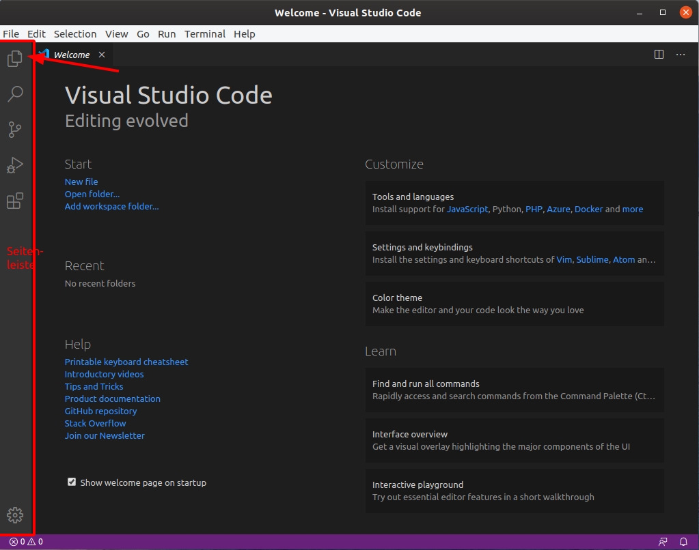

In der Seitenleiste gibt es verschiedene Unterbereiche, zwischen denen Sie mit einem Klick auf das jeweilige Icon wechseln können.
Als erstes sollten Sie den "Explorer" Unterbereich öffnen, in dem Sie auf das erste Icon oben links klicken.

Eine "Integrated Development Environment" (IDE) wie VS Code ist im Grunde ein Texteditor mit vielen Extra-Funktionen, die die Arbeit mit Quelltexten einfacher macht.
Ein Python-Programm wird am Anfang typischerweise nur aus einer einzelnen Quelltext-Datei bestehen, aber mit zunehmender Komplexität wird die Funktionalität auf mehrere Quelltext-Dateien verteilt werden.
Auch macht es für den Kurs Sinn, die Quelltexte gemeinsam in Ordnern abzuspeichern.
Legen Sie z.B. in ihrem Benutzerordner einen Unterordner `lehre` und darunter einen Unterordner `nlp` an.
Sie können den Ort des Projektordners frei wählen und je nach Betriebssystem befindet sich der Benutzerordner an anderer Stelle.
Öffnen sie danach den neu erstellen Projektordner in VS Code, in dem Sie in der Explorer-Seitenleiste "Open Folder" auswählen.

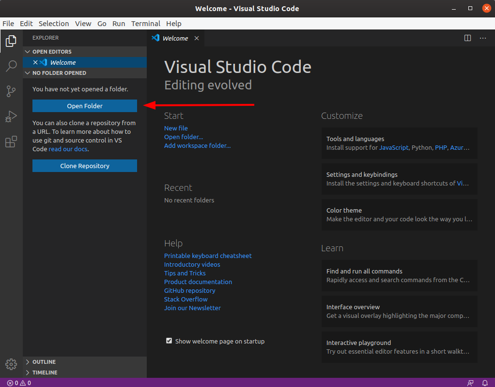

Alternativ können Sie einen Projektordner auch über den Menüeintrag "File -> Open Folder ..." öffnen.

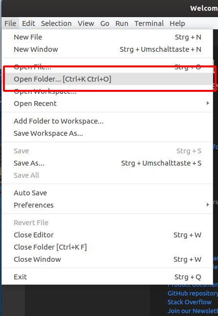

Im Moment ist der Ordner leer, deswegen werden auch im Explorer keine Dateien angezeigt.
Wenn Sie die Maus auf den Bereich mit dem Ordnernamen bewegen, erscheinen zwei kleine Icons mit denen Sie entweder eine neue Datei anlegen (erstes Icon) oder einen Unterordner erstellen können (zweites Icon).

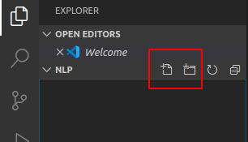

Erstellen Sie eine Textdatei mit dem Namen `Notizen.txt`, in dem Sie auf das Symbol für die neue Datei klicken, den Dateinamen eingeben und <kbd>⏎</kbd> (die Eingabetaste oder auch "Enter") drücken. 

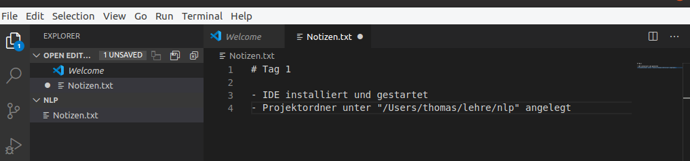

In diese Textdatei können Sie jetzt einen beliebigen Text schreiben.
Wie bei anderen Texteditoren auch zeigt VS Code an, dass die Datei geändert wurde.
Wenn es ungespeicherte Änderungen gibt, wird oben neben dem Dateinamen ein runder Kreis eingeblendet.
Speichern Sie die Änderungen mit dem Tastaturkürzel <kbd>STRG</kbd>+<kbd>S</kbd> oder den Menüeintrag "File -> Save".
Danach wird er Kreis zu einem Kreuz, mit dem sie das Texteditorfenster schließen können.
Mit einem Klick auf den auf die Datei im der Explorer-Seitenleiste können Sie die Datei wieder öffnen.
Wenn Sie den Projektordner im Dateimanager Ihres Systems öffnen, sollten Sie die neue Datei `Notizen.txt` sehen können.

## Python-Konsole

Bisher haben wir noch nichts mit VS Code gemacht, das spezifisch für Python wäre.
Python-Programme werden über das Programm `python3` ausgeführt, das durch Miniconda mit installiert wurde.
Um das `python3` Programm zu starten, müssen Sie erste einmal ein Terminal öffnen.
Sie könnten das System-Terminal starten, aber VS Code integriert bereits ein Terminal.
Um ein neues Terminal in VS Code zu starten, klicken Sie in Menü auf "Terminal -> New Terminal".

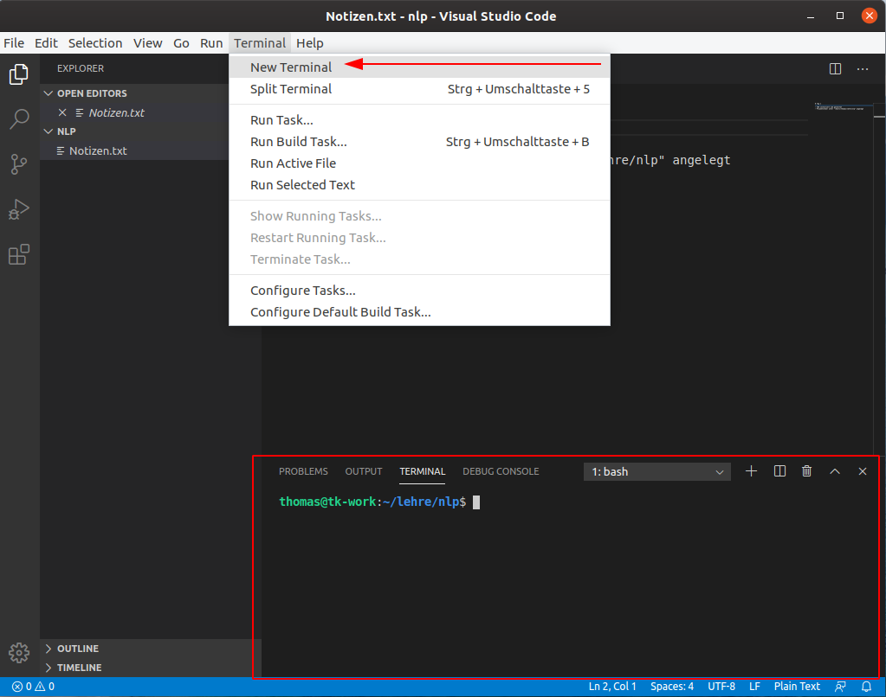

Daraufhin wird das Terminal im unteren Bereich angezeigt.
Je nach Betriebsystem sieht das Terminal etwas anders aus, in MacOS und Linux wird eine Unix-Shell verwendet (z.B. "bash" oder "sh").
Wenn Sie den Befehl erneuert auswählen, wird ein neues Terminal gestartet, das alte ist dann aber immer noch da.
Sie können über die "Dropdown" Box zwischen den verschiedenen Terminals hin und herschalten.

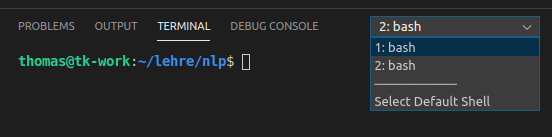

Falls Sie das Terminal verdeckt haben, können Sie diese Ansicht auch über den Menüeintrag "View -> Terminal" wieder anzeigen.

> ## Windows Terminal-Auswahl
>
> Windows hat die "Command Prompt" oder "Powershell" zur Auswahl.
> Es kann passieren, dass VS Code die Powershell startet. Für diesen Kurs ist die "Command Prompt" allerdings besser geeignet.
> In der gleichen Auswahl, in der Sie zwischen den offenen Terminals wechseln können, gibt es auch einen Eintrag "Select Default Shell".
> Wählen Sie diesen Eintrag und klicken Sie in der darauf folgenden Auswahl auf "Command Prompt".
>
> 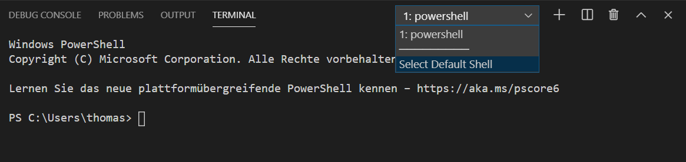
>
> 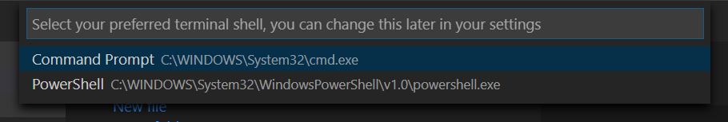
{: .callout}

Python ist auch nur ein Programm, dass über einen Terminal-Befehl gestartet werden kann.
Damit die richtige Version von Python gefunden wird, müssen Sie zuerst die Miniconda-Umgebung aktivieren.
Führen Sie dazu den folgenden Befehl aus:
~~~bash
conda activate
~~~
Nach Ausführen des Befehls wird am Anfang des Command-Prompt `(base)` stehen.
Danach können Sie das Programm "python3" ausführen, um die interaktive Python-Konsole zu starten:
~~~bash
python3
~~~

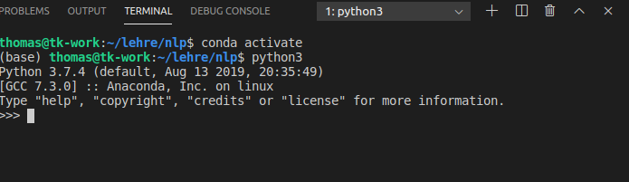

In der Python-Konsole können *einzelne Python-Befehle* ausgeführt und getestet werden.
Z.B. können Sie die folgende Zeichenketten in die Konsole eintipppen und die Eingabetaste drücken

~~~python
print("Hello World")
~~~
Jeder einzelne Befehl, der mit der Eingabetaste abgeschlossen wird kann eine Ausgabe als Text produzieren, der in der Konsole angezeigt wird sobald der Befehl abgeschlossen ist. 
Hier z.B. ist die Ausgabe.
~~~
Hello World
~~~
{: .output}

> ## Übung
> Geben Sie einen Befehl ein, der die Zeichenkette `Hallo Python` in der Konsole anzeigt.
>> ## Lösung
>> ~~~python
>> print("Hallo Python")
>> ~~~
> {: .solution}
{: .challenge}

Um die Python-Konsole wieder zu beenden, geben Sie den Befehl 
~~~python
exit()
~~~
ein. Daraufhin sind Sie wieder im normalen System-Terminal.

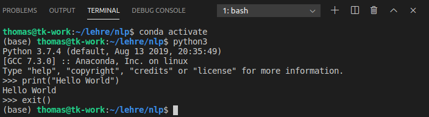

Wenn Sie jetzt wieder `python3` ausführen wollen, müssen sich nicht noch einmal die Conda-Umgebung aktivieren, da der Prompt `(base)` anzeigt, dass Conda immer noch aktiv ist.
Falls Sie VS Code oder das Terminal beenden, müssen Sie die Conda-Umgebung eventuell neu aktivieren. Je nachdem wie Sie Miniconda installiert haben, kann es auch sein, das die Conda-Umgebung bereits aktiviert ist, wenn Sie ein beliebiges Terminal starten.

## Quelltext-Dateien

Python-Programme besteht aber typischerweise aus vielen Anweisungen, die in einer oder mehreren Quelltext-Datei gebündelt werden.
Ein typischer Arbeitsablauf kann also sein, in der Konsole eine Abfolgen von Befehlen auszuprobieren und diese dann in die Quelltext-Datei zu kopieren.

Erstellen Sie eine neue Datei mit dem Namen `hello.py` und öffnen Sie diese im Texteditor von VS Code.
Die Dateiendung `.py` zeigt an, dass dies eine Python-Quelltextdatei ist.
Fügen Sie dann folgende zwei Zeilen zu der Textdatei hinzu und speichern Sie Datei:
 ~~~python
print("Hello World")
print("Hallo Python")
~~~

Sie können jetzt wieder das `python3` Programm nutzen, um den Python-Code auszuführen.
Anstatt aber jede Zeile interaktiv einzutippen, geben Sie den relativen Pfad zur Datei als Argument des Programmaufrufs an.

~~~bash
python3 hello.py
~~~
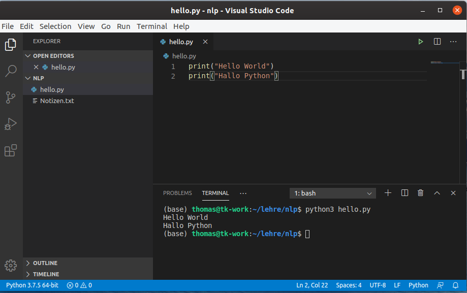

Herzlichen Glückwunsch, Sie haben ihr erstes eigenes Python-Programm ausgeführt!

Wenn eine Datei als Argument übergeben wird, wird `python3` diese Anweisung für Anweisung ausführen und alle Ausgaben, die z.B. mit dem Python-Befehl `print()` gemacht werden ausgeben.

~~~
Hello World
Hallo Python
~~~
{: .output}



