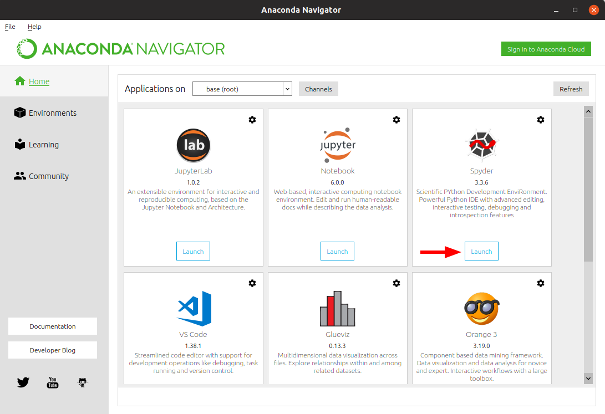
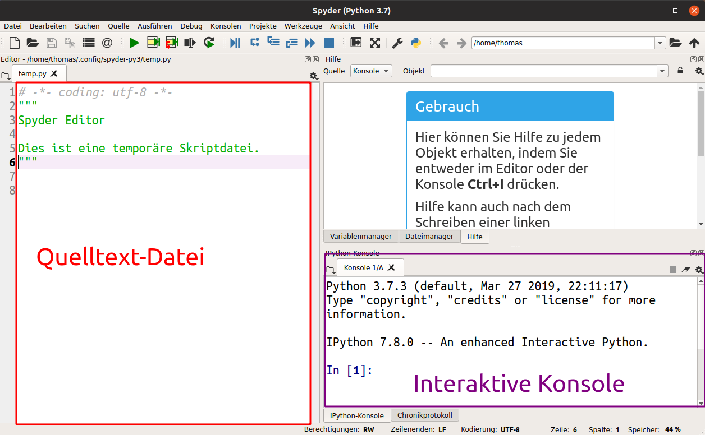
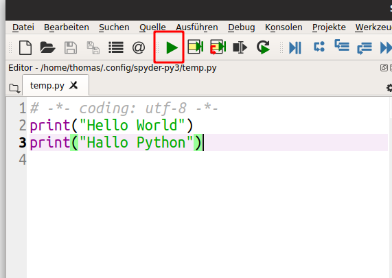

## Python IDE starten

Nach der Installation sollten Sie unter unter Windows und Mac OS einen Eintrag "Anaconda Navigator" im Startmenü bzw. im Launchpad haben.
Unter Linux müssen das Programm `anaconda-navigator` ausführen, z.B. unter Ubuntu mit der Tastenkombination <kbd>Alt</kbd>+<kbd>F12</kbd> und dann `anaconda3/bin/anaconda-navigator`.

Der *Anaconda Navigator* bietet verschiedene Programme zum Starten an, mit denen man Python-Programme entwickeln und ausführen kann. 
In diesem Kurs wollen wir die Integrierte Entwicklungsumgebung (IDE für "Integrated Development Environment") *Spyder* nutzen.
Klicken Sie auf "Launch" unter dem Eintrag für Spyder um das Programm zu starten.s

Auf der Linken Seite von Anaconda befindet sich eine Texteditor für Quelltext-Dateien von Python.
Rechts unten ist ein interaktives Terminal (auch „Konsole“ oder „Kommandozeile“ genannt) platziert.

## Python-Terminal

Im Python-Terminal können *einzelne Python-Befehle* ausgeführt und getestet werden.
Z.B. können Sie die folgende Zeichenketten in die Konsole eintipppen und die Eingabetaste drücken

~~~python
print("Hello World")
~~~
Jeder einzelne Befehl, der mit der Eingabetaste abgeschlossen wird kann eine Ausgabe als Text produzieren, der in dem Terminal angezeigt wird sobald der Befehl abgeschlossen ist. 
Hier z.B. ist die Ausgabe.
~~~
Hello World
~~~
{: .output}

> ## Übung
> Geben Sie einen Befehl ein, der die Zeichenkette `Hallo Python` im Terminal anzeigt.
>> ## Lösung
>> ~~~python
>> print("Hallo Python")
>> ~~~
> {: .solution}
{: .challenge}

## Quelltext-Dateien

Python-Programme besteht aber typischerweise aus vielen Anweisungen, die in einer oder mehreren Quelltext-Datei gebündelt werden.
Ein typischer Arbeitsablauf kann also sein, in der Konsole eine Abfolgen von Befehlen auszuprobieren und diese dann in die Quelltext-Datei zu kopieren.

Z.B. kann man die beiden Befehle von vorher 
- als jeweils eine Zeile hintereinander in die Quelltextdatei schreiben,
 ~~~python
print("Hello World")
print("Hallo Python")
~~~
- die Datei mit der Endung `.py` abspeichern
- und mit dem Klick auf das grüne Rechteck oder dem Tastenbefehl <kbd>F5</kbd> in dem Terminal ausführen



