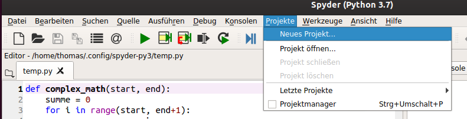
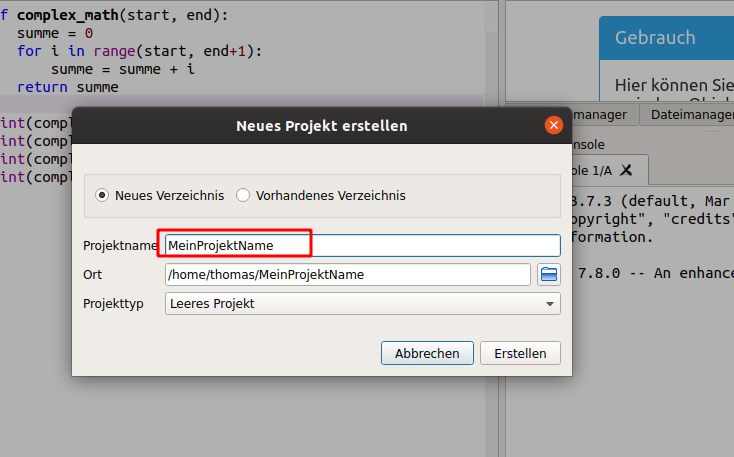
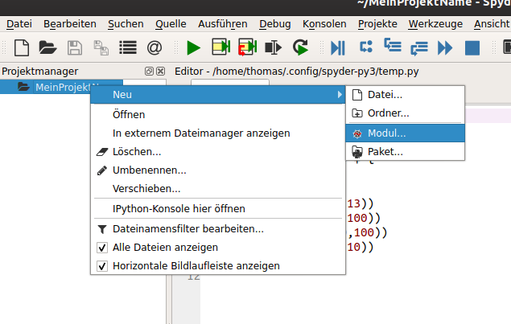
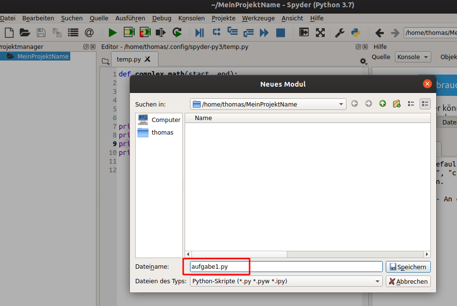
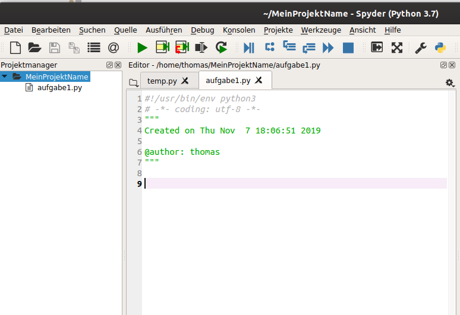
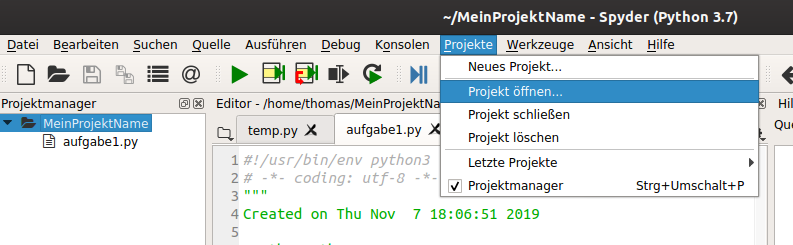
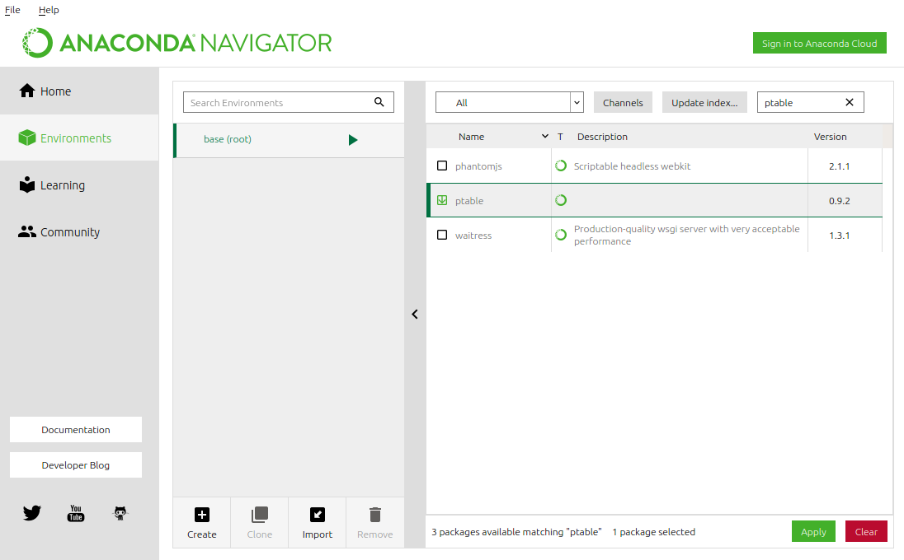

## Eigene Funktionen definieren

Bisher haben wir uns nur mit einfachen Anweisungen
beschäftigt. Typischerweise wollen wir aber nicht immer wieder
neu eingreifen, sondern unser Programm soll eine komplexe
Anweisung auf einmal ausführen. Dafür müssen wir unseren
Code als Funktion definieren:
~~~python
def add_mult(a, b):
    output = a + b
    output = output + (a * b)
    return output
~~~

Eine Funktion besteht aus der Funktionsdefinition, die mit den Schlüssewort `def` eingeleitet und mit dem Doppelpunkt abgeschlossen wird.
Darin steht der Name der Funktion (hier `add_mult`) und die Namen der Argumente, abgetrennt durch Komma.
In dem Beispiel werden zwei Argumente `a` und `b` übergeben.

Der Funktionsdefinition folgt ein Code-Block, der die Funktion implementiert.
Der Block ist hier mit der `return` Anweisung abgeschlossen, die die Funktion beendet und den Rückgabewert definiert.

Nachdem eine Funktion definiert ist, kann sie im Code aufgerufen werden, genauso wie die eingebauten Funktionen auch.

~~~python
v = add_mult(1, 100)
print(v)
~~~

> ## Übung
> Schreiben Sie eine Funktion, die gegeben zweier Werte die Summe aller Zahlen zwischen dem ersten und dem zweiten Wert (inklusive) angibt.
> Rufen Sie diese Funktion für verschiedene Werte auf und geben Sie die Werte aus.
> Für z.B. die Argumente 5 und 13 soll die Funktion die Summe
> 5 + 6 + 7 + 8 + 9 + 10 + 12 + 13 = 81 
> berechnen.
>> ## Lösung
>> ~~~python
>> def complex_math(start, end):
>>     summe = 0
>>     for i in range(start, end+1):
>>         summe = summe + i
>>     return summe
>> 
>> print(complex_math(5,13))
>> print(complex_math(1,100))
>> print(complex_math(20,100))
>> print(complex_math(1,10))
>> ~~~
>> ~~~
>> 81
>> 5050
>> 4860
>> 55
>> ~~~
>> {: .output}
> {: .solution}
{: .challenge}

Funktionen können Werte von verschiedenen Typen als Argument bekommen.
Auch kann die gleiche Funktion verschiedene Typen von Werten zurückgeben und je nach Bedingungen verschiedene
`return` Anweisungen ausführen (es wird aber immer nur die erste `return` Anweisung ausgeführt).

~~~python
def fancy_add(val):
    if isinstance(val, str):
        return  val + " + 1"
    elif isinstance(val, int):
        return val + 1
    elif isinstance(val, float):
        return val + 1.0
    else:
        return 42

print(fancy_add(2))
print(fancy_add(2.0))
print(fancy_add("2"))
print(fancy_add(False))
~~~
~~~
3
3.0
2 + 1
1
~~~
{: .output}

Der Code nutzt die eingebaute Funktion `isinstance` um zu überprüfen, ob eine Variable einen gegebenen Typ hat.

Außerdem ist es möglich, dass eine Funktion mehr als einen Wert zurückgibt. 
In diesem Fall muss die `return` Anweisung alle Werte mit Komma getrennt auflisten.
Die Zuweisung von mehreren Werten beim Aufruf einer Funktion erfolgt ebenfals durch Auflistung mit Komma.

~~~python
def get_str_info(text):
    l = len(text)
    c = text[0]
    return l, n

a, b = get_str_info("This is an arbitrary string, I swear")
~~~
~~~
36
T
~~~
{: .output}

> ## Frage
> Was bedeuten die Werte, die die Funktion zurückliefert?
{: .callout}

In Python wird unterschieden zwischen positionalen Argumenten, die übergeben werden müssen und Keyword-Argumenten, die optional sind und für die ein Standard-Wert in der Funktions-Definitions angegeben werden kann, der genutzt wird wenn das Argument nicht übergeben wird. 
Hier ein Beispiel:
~~~python
def print_log(log_text, with_exclamation_marks=False):
    out = log_text if not with_exclamation_marks else ('!!! '+log_text+' !!!')
    print(out)
    
print_log('Nothing happend.')
print_log('Alarm', with_exclamation_marks=True)
print_log('Alarm', True)
~~~
~~~
Nothing happend.
!!! Alarm !!!
!!! Alarm !!!
~~~
{: .output}
Der Standardwert für das Argument `with_exclamation_marks` ist hier `False`.


## Module und der `import` Befehl

### Spyder-Projekte

Bisher haben wir immer nur einzelne Python-Dateien in Spyder geöffnet, gespeichert und ausgeführt.
Man kann mehrere Dateien in einem Projekt-Ordner in Spyder gemeinsam verwalten. 
Ein Projekt kann z.B. eine Hausaufgabe für eine Woche mit verschiedenen Python-Dateien für jede einzelne Aufgabe sein.

Rufen Sie dazu im Menü `Projekt -> Neues Projekt` auf.


Dann wählen Sie einen Namen und einen Ort für das neue Projekt und wählen „Erstellen“.


Ein Spyder-Projekt ist ein normaler Ordner im Datei-System, in dem Sie neue Dateien hinzufügen können.
Z.B. können Sie im *Projektmanager* auf den Projektordner rechts klicken und dann `Neu -> Modul` auswählen um eine neue Python-Datei anzulegen.


Geben Sie einen neuen Namen für die Datei an (mit Endung `.py`) und drücken Sie speichern.


Danach erscheint die neue Datei auch im *Projektmanager* und kann im Editor geöffnet und editor werden.


Wenn Sie Spyder neu starten, können Sie einen bestehenden Projekt-Ordner über den Menüeintrag `Projekt -> Projekt öffnen` wieder öffnen.


### Eigene Module

Jede Python-Datei ist gleichzeitig eine sogenanntes *Modul*.
Man z.B. kann man das folgende Python-Skript mit dem Namen `poornlp.py` abspeichern:

~~~python
def get_str_info(text):
    l = len(text)
    c = text[0]
    return l, c

def is_noun(word):
    return word[0].isupper()
~~~

Dieses enthält jetzt die beiden Funktionen `get_str_info` und `is_noun`.
Durch das Speichern in der Datei haben wir ein Modul gleichen Names (`poornlp`) erzeugt.
Nun wollen wir diese Funktionen ja nachnutzen und nicht jedes mal in unsere Skripte kopieren.
Zum Laden der Funktion in ein eigenes Skript oder in die interaktive Konsole kann man den `import` Befehl benutzen.
Angenommen, das Skript mit dem Modul befindet sich im gleichen Ordner, dann kann man 
~~~python
import poornlp
~~~
aufrufen und bekommt Zugriff auf die beiden Funktionen über den Modulnamen, gefolgt von einem `.`:
~~~python
poornlp.get_str_info("Das ist ein Text")
~~~

Möchte man eine bestimmte Funktion aus einem Modul importieren, geht das mit `from ... import`:
~~~python
from poornlp import get_str_info
~~~
Danach ist es nicht mehr notwendig, für die importierte Funktion den Modulenamen anzugeben:
~~~python
get_str_info("Das ist ein Text")
~~~

Wenn das Modul in einem Unterordner liegt, kann man ebenfalls durch `import` darauf zugreifen, muss aber wieder einen Punkt zwischen dem Elternmodul (dem Ordner) und dem Kindermodul angeben.
Z.B. sei eine Ordnerstruktur mit einem Ordner `mathmodules` und zwei Python-Dateien in dem Ordner gegeben
~~~
mathmodules/
├── basic.py
└── fancy.py
~~~
basic.py:
~~~python
def add(a,b):
    return a + b
~~~
fancy.py:
~~~python
def add(val):
    if isinstance(val, str):
        return  val + " + 1"
    elif isinstance(val, int):
        return val + 1
    elif isinstance(val, float):
        return val + 1.0
    else:
        return 42
~~~

Der Import für `basic` sehe dann folgendermaßen aus:
~~~python
import mathmodules.basic
mathmodules.basic.add(5,10)
~~~
Auch Untermodule müssen importiert werden, z.B. würde
~~~python
mathmodules.fancy.add("A")
~~~
fehlschlagenn wenn nur `mathmodules` oder `mathmodules.basic`, aber nicht `mathmodules.fancy` importiert worden ist.
~~~
Traceback (most recent call last):
  File "<stdin>", line 1, in <module>
AttributeError: module 'mathmodules' has no attribute 'fancy'
~~~
{: .output}

Manchmal sind die Modulnamen  sehr lang, dann kann man über `import ... as ...` abgekürzt werden
~~~python
import mathmodules.basic as mb
mb.add(42,3.13)
~~~

Ähnliches geht auch, wenn man Funktionsnamen mit `from ... import ... as ...` importiert, was sogar eine Umbennung der Funktion erlaubt und hilft Namenskonflikte aufzulösen:
~~~python
from mathmodules.fancy import add as fancy_add
fancy_add(42)
~~~

## Module der Standardbibliothek

Python besitzt neben den eingebauten Funktionen und Typen auch noch eine riesige sogenannte Standardbibliothek.
Dies sind Module, die in allen Python-Installationen (für eine bestimmte Version von Python) immer vorhanden sind.
Sie können also erwarten, dass Sie in jedem Skript diese Module importieren können.

Eine Auflistung und Dokumentation der Module der Standardbibliothek findet sich unter <https://docs.python.org/3.7/library/index.html>.


### Reguläre Ausdrücke auf Strings mit Modul `re`

Ein Beispiel für eine sehr nützliches Module aus der Standardbibliothek ist das Modul für reguläre Ausdrücke (also Mustersuche) mit dem Namen `re`.
Muster oder „Patterns“ müssen erst einmal erstellt („kompilliert“) werden und kann dann auf Strings angewendet werden.
~~~python
import re
pattern = re.compile('Glü.+')
search_in = 'Hallo, was für ein Glück, dass wir uns heute treffen!'
# gibt einen bool zurück, wenn der ganze String dem Pattern matched
is_match = pattern.match(search_in)   
# gibt bool zurück, wenn ein Teilstring dem Pattern matched
found = pattern.search(search_in)

if is_match:
    print('It is a full match!')
elif found:
    print('I found it somewhere!')
~~~
~~~
I found it somewhere!
~~~
{: .output}

Auf der [Dokumentation des Moduls `re` ](https://docs.python.org/3.7/library/re.html) gibt es eine Einführung in die Syntax dieser Patterns und wie man nicht nur ja/nein Suchen sondern auch die Position des Treffers bekommen kann. 

## Module aus Anaconda

Anaconda ist eine Python-Distribution, in der bereits viele Pakete für NLP, Machine Learning und Data Science vorinstalliert sind.
Im Anaconda Navigator kann man über „Environments“ 
- überprüfen welche Pakete bereits vorhanden sind
- die installierten Pakete aktualisieren
- neue Pakete aus Anaconda installieren



### Installation neuer Pakete mit `pip`

Hilfreiche allgemeine Python-Pakete, die nicht in Anaconda enthalten sind, können über den „Python Package Index“ unter
[https://pypi.org](https://pypi.org) gefunden werden.
Die Installation auf dem lokalen System erfolgt dann mit dem Kommandozeilentool
`pip`.
Um die Sytem-Kommandozeile auzurufen, muss man unter **Windows** im Startmenü „Anaconda Prompt“ suchen und auswählen.
Unter **Mac OS** können Sie eine System-Kommandozeile starten, in dem Sie mit [Spotlight](https://support.apple.com/de-de/HT204014) nach Terminal suchen und dieses starten.
Danach müssen Sie unter Mac OS (aber nicht unter Windows) die Anaconda-Umgebung aktivieren, in dem Sie einmal
```bash
conda activate
```
im Terminal eingeben (der letzte Schritt ist unter Umständen auch unter Linux notwendig).
Falls Sie mehr über die Bedienung von System-Kommandozeilen erfahren wollen, können Sie sich z.B. das Tutorial unter <https://tutorial.djangogirls.org/de/intro_to_command_line/> anschauen.

Anaconda bring schon sehr viele Pakete mit, aber nichts um sogenannte [ASCII Art](https://de.wikipedia.org/wiki/ASCII-Art) automatisch zu generieren. 
Eine Suche im Python Package Index liefert aber z.B. das Paket `art` um ASCII Art zu generieren:
[https://pypi.org/project/art/](https://pypi.org/project/art/)

Mit dem Befehl
~~~bash
pip install art
~~~
in der System-Kommandozeile kann das Paket installiert werden.

Danach ist es über `import art` für eigene Python-Skripte oder auf der interaktiven Python-Konsole verfügbar:
~~~python
import art

print(art.text2art("Python"))
~~~
~~~
 ____          _    _                   
|  _ \  _   _ | |_ | |__    ___   _ __  
| |_) || | | || __|| '_ \  / _ \ | '_ \ 
|  __/ | |_| || |_ | | | || (_) || | | |
|_|     \__, | \__||_| |_| \___/ |_| |_|
        |___/                           
~~~
{: .output}


