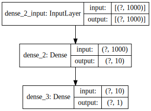

## Einführung

Textklassifizierung kann für verschiedene Bereiche eingesetzt werden, um Texte Kategorien zuzuweisen.
Beispiele dafür sind
- die Kategorisierung von E-Mails in Spam oder Nicht-Spam,
- eine Zuordnung eines Textes zu einem Autor oder Eigenschaften des Autors,
- Positives oder negative Haltung bestimmen (zum Beispiel bei einer Produkt-Bewertung),
- die Sprache eines Textes zu identifizieren.

## Bag-Of-Words

Textklassifikation hat den gesamten Text als Eingabe und die Klasse als Ausgabe.
Neuronale Netzwerke haben aber Vektoren von Zahlen als Ein- und Ausgabe.
Um die Ausgabe zu kodieren, kann man Vektoren nutzen, die die gleiche Länge wie die Anzahl der Klassen haben.
Jeder Klasse wird dann ein Index des Ausgabe-Vektors zugeordnet.
Nach Berechnung der Ausgabe des neuronalen Netzwerk ist dann die Klasse, die dem Index mit dem höchsten Wert im Vektor zugeordnet ist die erkannte Klasse.
Wenn man zum Beispiel zwischen den Sprachen „Englisch“, „Deutsch“, „Französisch“ unterscheiden möchte, hat man 3 Klassen und damit Vektor der Länge drei.
Wenn wir also zum Beispiel die Ausgabe `(0.13, 0.99, 0.4)` haben und Englisch dem ersten Index, Deutsch dem zweiten und Französisch dem dritten Index zugeordnet ist, dann wurde vom neuronalen Netz die Klasse „Deutsch“ vorhergesagt.
Im Fall, dass man nur zwei Klassen hat (z. B. negativ und positiv) kann man auch nur einen einzelnen Wert aus Ausgabe nehmen, der dann `0` für die erste Klasse und `1` für die zweite Klasse ist.

Für die Eingabe, also den eigentlichen Text, müssen wir aber auch eine geeignete Vektordarstellung finden.
Dazu nutzen wir in diesem Tutorial sogenannte *Bag-Of-Words*.
Diese Darstellung reduziert den Text auf die Anzahl der genutzten Wörter aus einem vorher festgelegten Vokabular.
Für jedes Wort aus dem Vokabular wir die Häufigkeit des Vorkommens bestimmt.
Der Kontext oder die Position des Worts im Text geht dabei verloren.

Der Beispieltext
```
By the time the film ended, I not only disliked it, I despised it.
```
würde sich folgende Darstellung ergeben:

| word     | #   |
| -------- | --- |
| by       | 1   |
| the      | 2   |
| time     | 1   |
| film     | 1   |
| ended    | 1   |
| ,        | 2   |
| i        | 2   |
| not      | 1   |
| only     | 1   |
| disliked | 1   |
| it       | 2   |
| despised | 1   |
| .        | 1   |

## Klassifzierung nach Sentiment

In diesem Tutorial wollen wir Texte nach ihrer Haltung (Sentiment) klassifizieren.
Dieses Beispiel ist adaptiert von <https://realpython.com/python-keras-text-classification/>.
Als Daten nutzen wir Kommentare aus der Internet Movie Database[^Kotzias2015].
Bitte laden Sie den „Data Folder“ von der Homepage des Datasets herunter: <https://archive.ics.uci.edu/ml/datasets/Sentiment+Labelled+Sentences> und entpacken Sie die Datei `sentiment labelled sentences.zip`.
Wir verwenden im Tutorial die Datei `imdb_labelled.txt`.
In dieser Datei sind zeilenweise IMDB-Kommentare mit der Annotation versehen, ob diese negativ (0) oder positiv (1) sind.

Der Kommentar
```
A very, very, very slow-moving, aimless movie about a distressed, drifting young man.
```
wurde dabei manuell mit dem Ausgabewert `0` markiert (ist also negativ) während z. B. folgender Kommentar den Wert `1` für positiv bekommen hat:
```
The best scene in the movie was when Gerardo is trying to find a song that keeps running through his head.
```

Unsere Aufgabe ist es nun, diese beiden Klassen automatisch mit einem neuronalen Netz auf ungesehener Eingabe zu unterscheiden.
Wir wollen also auf den Goldstandard-Daten der IMDB-Kommentare das Netzwerk trainieren und auf neuen Daten anwenden können.
Dafür sind mehrere Schritte, von der Aufbereitung der Daten bis zur Definition der Netzwerkstruktur, dem eigentlichen Trainieren und Code zum Ausführen des trainierten Netzwerks notwendig.

## Tensorflow (mit Keras API)


Für dieses Beispiel nutzen wir Tensorflow mit der Keras API.
Tensorflow kann über pip installiert werden.

```bash
pip install tensorflow
```


## Einlesen der CSV Dateien

Der erste Schritt ist das Einlesen der Trainingsdaten.
Die Datei `imdb_labelled.txt` ist eine CSV- bzw. TSV-Datei: jede Zeile ist ein Datenpunkt und die Informationen in den Zeilen sind durch Tabs separiert (TSV steht für „Tab separated values“, „CSV“ dementsprechend für „Comma separated values“, wird aber oft als Oberbegriff für alle solche Formate unabhängig vom Trennzeichen verwendet).
Wir definieren dazu die Funktion `read_csv`, die das Einlesen übernimmt und eine Liste von Sätzen/Kommentaren und eine Liste der Kategorien (also die „labels“) zurückgibt.
Diese Funktion (und alle anderen Hilfsfunktionen) werden im Modul `util` definiert, müssen also in einer Datei mit dem Namen `util.py` gespeichert werden.

```python
# Liest eine CSV-Datei mit Sätzen und Labeln (0 negativ, 1 positiv) ein
def read_csv(file):
    sentences = []
    labels = []
    
    with open(file, "r") as f:
        # Jede Zeile der Datei einlesen
        for line in f.readlines():
            # Zeile in zwei Teile spalten (durch Tab getrennt)
            splitted = line.split('\t')
            # Den Satzteil und das Score jeweils an die entsprechende Liste anhängen
            sentences.append(splitted[0])
            # Das Label muss zu einer Zahl konvertiert werden 
            labels.append(float(splitted[1]))
    # Beide Listen zurückgeben
    return (sentences, labels)
```

## Erstellen eines Vokabulars

Für die Bag-Of-Words-Repräsentation benötigen wir ein Vokabular.
Dazu implementieren wir folgene Funkion, die ein Vokabular der 999 häufigsten Wörter aus einer gegebenen Liste von Sätzen berechnet.

```python
# Erstellt eine Zuordnung von den 999 häufigsten Wörtern zu einer ID
def create_vocabulary(sentences):
    # Erstelle eine Listen mit allen Wörtern
    # Ein Wort kann mehrfach vorkommen, ist aber immer klein geschrieben
    all_words = list()
    for s in sentences:
        for token in nltk.tokenize.word_tokenize(s):
            all_words.append(token.lower())
    # Erstelle  eine Frequenzliste aller Wörter
    fdist = nltk.FreqDist(all_words)
    
    # Erstelle eine Zuordnung von den 999 häufigsten Wörtern zu einer ID
    vocabulary = dict()
    # Die ID 0 wird freigelassen für unbekannte Wörter
    ident = 1
    for word, _ in fdist.most_common(999):
        vocabulary[word] = ident
        ident = ident + 1
    
    return vocabulary
```

## Erstellen eines Bag-Of-Words für jeden Satz

Als nächsten Schritt definieren eine Funktion, die die eigentlichen Bag-Of-Words für alle Sätze gegeben des Vokabular berechnet.
Da das Vokabular nicht vollständig ist, werden alle unbekannten Wörter mit der speziellen ID 0 kodiert.

```python
# Erstellt eine Liste von Bag-Of-Words-Vektoren für eine Liste von Sätzen.
def create_bag_of_words(sentences, vocabulary):
    result = []
    for s in sentences:
        # Erstelle Liste mit nullen
        # Die Liste ist so lang wie es Einträge im Vokuabular gibt (plus 1 für die 0)
        # Jedes Listenelement entspricht der Anzahl der Token für die ID an dieser Position
        v = [0]*(len(vocabulary)+1)
        for token in nltk.tokenize.word_tokenize(s):
            token = token.lower()
            # Unbekannte Wörter bekommen die ID 0
            identifier = 0
            if token in vocabulary:
                # Schlage die ID für bekannte Wörter im Vokabular nach
                identifier = vocabulary[token]
            # Erhöhe die Anzahl der Wörter mit dieser ID um 1
            v[identifier] = v[identifier] + 1
        # Hänge den Bag-Of-Word Vektor für diesen Satz an das Ergebnis an
        result.append(v)
    # Gebe die Bag-Of-Word Vektoren als Liste zurück
    return result
```

## Aufbereitung der Daten

Um beurteilen zu können, wie gut das neuronale Netz gelernt hat, trennen wir die Daten in eine Trainingsdatenmenge und eine Testdatenmenge auf.
Die Performanz (also Anzahl korrekter Vorhersagen) wird dann auf den ungesehenen Testdaten berechnet.

Aus den Trainingsdaten berechnen wir das Vokabular: die Testdaten dürfen nicht ins Vokabular eingehen, da diese ja ungesehene neue Daten repräsentieren. 
Für beiden Datenmengen wird mit dem Vokabular für jeden Satz eine Bag-Of-Words Vektorrepräsentation erstellt.

```python
import util
import dill

# CSV Datei einlesen
sentences, y = util.read_csv("imdb_labelled.txt")

# Aufspalten in Training und Testmengen
# 75% der Daten zum Training, 25% zum Testen
split_position = int(len(sentences) * 0.75)
# Trainingsdaten
sentences_train = sentences[:split_position]
y_train = y[:split_position]
# Testdaten
sentences_test = sentences[split_position:]
y_test = y[split_position:]

# Erstelle Vokabular aus den Traningsdaten 
# und transformiere alle Sätze in Bag-Of-Words Vektoren
vocabulary = util.create_vocabulary(sentences_train)
x_train = util.create_bag_of_words(sentences_train, vocabulary)
x_test = util.create_bag_of_words(sentences_test, vocabulary)
```

##  Trainieren eines neuronalen Netzes

Wir kommen jetzt zum eigentlichen Training.
Dazu definieren wir ein Netzwerk mit der folgenden Struktur:



Der Eingabe-Layer hat 1000 Neuronen, da unser Vokabular 999 Wörter plus das ungesehene Wort umfasst.
Jedes Neuron im Eingabe-Layer bekommt die Anzahl des ihm zugeordneten Worts als Eingabe.
Danach wird ein einfacher Hidden-Layer mit 10 Neuronen geschaltet.
Die Ausgabe hat nur ein Neuron, das entweder den Wert `0` für negativ oder `1` für positiv annehmen soll.

Das folgende Skript nutzt nun die Tensorflow-API um dieses Netzwerk zu definieren und die passenden Gewichte für die bereits erstellten Trainingsdaten zu lernen.
Tensorflow überprüft für die verschiedenen Iterationen der Gewichtsanpassungen mit Hilfe der Testdaten, wie gut das Netz bereits gelernt hat.
Die trainierten Modelldaten (inklusive Vokabular) werden gespeichert

```python
from tensorflow.keras.models import Sequential
from tensorflow.keras import layers

# Definiere ein Neuronales Netz mit einem Bag-Of-Words Vektor als Eingabe
# einem Hidden Layer und einer Ausgabe
model = Sequential()
model.add(layers.Dense(10, input_dim=len(x_train[0]), activation='relu'))
model.add(layers.Dense(1, activation='sigmoid'))

# Muss einmal "kompiliert" werden
model.compile(loss='mse', optimizer='adam', metrics=['accuracy'])
print(model.summary())

# "fit" trainiert das Modell auf den gegebenen Daten
model.fit(x_train, y_train, epochs=20, validation_data=(x_test, y_test), batch_size=10)
model.save("classifier.h5")
# Auch das Vokabular abspeichern, sonst können wir keine neuen Vektoren erstellen
dill.dump(vocabulary, open("vocabulary.dat", "wb"))
```


## Ausgabe für ein paar Testdaten

Mit den gespeicherten Modelldaten können wir nun in einem neuen Skript eigene Eingaben ausprobieren.

```python
import util
import dill
from tensorflow.keras.models import load_model

# Vokabular und Modell des neuronalen Netzes laden
vocabulary = dill.load(open("vocabulary.dat", "rb"))
model = load_model("classifier.h5")

# Beispieleingaben erzeugen
example_sentences = ["This movie is worse than anything else.",
                     "Best movie ever!",
                     "You can not imagine a better movie!",
                     "I would love to see this again. Bruce Wayne is great.",
                     "YAML SDFA FAFAFCA FAF AFAF"]
x = util.create_bag_of_words(example_sentences, vocabulary)

# Ausgabe vorhersagen
y = model.predict(x)
for i in range(0, len(y)):
    print(example_sentences[i], y[i])
```

~~~
This movie is worse than anything else. [0.10687903]
Best movie ever! [0.7610351]
You can not imagine a better movie! [0.09572864]
I would love to see this again. Bruce Wayne is great. [0.9571661]
YAML SDFA FAFAFCA FAF AFAF [0.5089223]
~~~
{: .output}

[^Kotzias2015]: Kotzias, Dimitrios, Misha Denil, Nando De Freitas, and Padhraic Smyth. 2015. “From Group to Individual Labels Using Deep Features.” In Proceedings of the 21th Acm Sigkdd International Conference on Knowledge Discovery and Data Mining, 597–606. ACM.


