## Einführung und Terminologie

Das Arbeiten an Quelltexten ist typischerweise inkrementell. 
Das führt schnell dazu, dass man Überblick über die verschiedenen Versionen verliert.
Beim Schreiben von Texten gibt es dann oft die Strategie, die Versionierung im Dateinamen auszudrücken (also z.B. "final.doc", "final_rev2.doc", final_final.doc").[^final]
Außerdem benötigen wir bei gemeinsamen Arbeiten in Projekten auch einen gemeinsamen Stand des Quelltexts, auf den alle Projektmitglieder zugreifen können.

[^final]: Zu den Problemen die durch „Versionen“ im Dateinamen entstehen können, sei auch die [PHD Comics Episode dazu](http://phdcomics.com/comics/archive.php?comicid=1531) empfohlen.


Anstatt manuell eigene Versionierungs-Mechanismen zu erarbeiten, können wir auch bestehende Versionskontrollsysteme (VCS) nutzen.
Dieses soll uns in die Lage versetzen
- Änderungen unabhängig vom Dokument betrachten,
- Änderungen in Dokumenten automatisch zu verfolgen,
- Änderungen rückgängig zu machen bzw. „zurückspulen“,
- nachvollziehen zu können, wer in dem Projekte welche Änderungen gemacht hat,
- nicht aus Versehen Änderungen anderer übersehen und/oder überschreiben.

Inzwischen hat sich das Kommandozeilen-Programm Git als de-facto Standard Versionskontrollsystem für Quelltexte etabliert.
Man kann es aber auch für andere Textdatei-lastige Projekte, wie zum Beispiel Korpusannotationsdateien nutzen.

Die Konzepte von Versionsverwaltungsprogrammen folgen einer eigenen Terminologie, die gerade am Anfang etwas überwältigend sein kann.
Im [Glossar](https://help.github.com/en/github/getting-started-with-github/github-glossary) der GitHub-Platform können Sie die wichtigsten Begriffe, die wir auch hier verwenden werden, nachschlagen.
Dazu gehören unter anderem,

- *repository* <https://help.github.com/en/github/getting-started-with-github/github-glossary#repository>
- *clone* <https://help.github.com/articles/github-glossary/#clone>
- *fetch* <https://help.github.com/articles/github-glossary/#fetch>
- *pull*  <https://help.github.com/articles/github-glossary/#pull>
- *commit*  <https://help.github.com/articles/github-glossary/#commit>

##  Tools und Plattformen

Um gemeinsam Quelltexte zu bearbeiten, benötigen wir zwei Dinge: 
- die Software zum Versionieren selbst (in diesem Fall Git)
- einen Ort an dem wir von Git erstellten Repositories abspeichern und von dem wir unsere eigenen Kopien synchronisieren.

Wir werden die grafische Oberfläche [GitHub Desktop](https://desktop.github.com/) (nicht zu verwechseln mit der Online-Platform GitHub.com, aber von der gleichen Firma) nutzen, die Sie von <https://desktop.github.com/> für Ihr Betriebsystem herunterladen können. 
Für Linux werden inoffizielle Installationspakete unter <https://github.com/shiftkey/desktop/releases/> bereitgestellt.
Gleichzeitig werden wir auch immer für jede Aktion in GitHub Desktop den entsprechenden Git-Kommandozeilen-Aufruf zeigen.
GitHub Desktop bringt seine eigene Git-Installation mit.
Um die Kommandozeilenbefehle nachzuvollziehen, müssen Sie Git für die Kommandozeile von <https://git-scm.com/downloads> installieren. Unter Linux ist `git` typischerweise schon in den Paketquellen vorhanden und kann zum Beispiel mit `sudo apt install git` unter Ubuntu installiert werden.

Eine populäre Platform für Git-basierte Projekte ist [GitHub.com](https://github.com/), die zum Konzern Microsoft gehört.
Diese erlaubt inzwischen auch das Erstellen von nicht-öffentlichen Projekten und kann daher auch für eigene Studien-Projekte geeignet sein.
Daneben gibt es aber auch Alternativen wie GitLab, das einerseits eine [zentrale Plattform](https://about.gitlab.com/) analog zu GitHub.com ist, deren Software man aber auch auf eigenen Servern installieren und betreiben kann.
Die HU-Berlin betreibt unter <https://scm.cms.hu-berlin.de/> eine solche GitLab-Instanz auf ihren eigenen Servern, auf der Sie sich mit Ihrem CMS-Acccount einloggen können.
Diese verschiedenen Plattformen haben oft ähnliche Funkionen, wie zum Beispiel Ticketsysteme zum Verwalten von Bugs und TODOs.
In diesem Tutorial werden wir die GitLab-Instanz der HU nutzen, aber das Prinzip ist für die anderen Plattformen gleich.

## Anlegen eines neuen lokalen Git-Repositories

Git arbeitet auf sogenannten *Repositories*, die alle Dateien und die komplette Versionshistorie beinhalten.
Ein Git-Repository besteht aus einem lokalen Ordner mit den zu versionierenden Dateien und einem speziellen versteckten Unterordner `.git`.

Zum Anlegen eines Git-Reppositories, starten Sie GitHub Desktop.
Beim ersten Start wird das Programm Sie auffordern, einen Account auf GitHub.com anzulegen, da wir das GitLab der HU nutzen werden, können Sie diesen Schritt bedenkenlos überspringen.


Trotzdem benötigt Git die Angabe eines Namens und einer E-Mail-Adresse.
Diese Informationen werden in der Versionshistorie als Felder für den Autor angezeigt. 
Beide Angaben werden nur lokal gespeichert und nicht verifiziert, weder der Name noch die E-Mail-Adresse müssen stimmen.


Wählen Sie im Startbildschirm von GitHub Desktop jetzt „Create a new Repository on your hard drive...“ aus, um ein neues Repository als Ordner in einem beliebigen Pfad anzulegen.


Falls bereits ein Repository offen ist, können Sie neue Repositories auch das Menü und "File -> New repository" anlegen.
Auf der Kommandozeile würde man erst einen neuen Ordner erstellen, in diesem mit `cd` wechseln und dann `git init` ausführen, um das gleiche Ergebnis zu erreichen.

~~~bash
mkdir nlp
cd nlp
git init
~~~
~~~
Leeres Git-Repository in /home/thomas/Dokumente/studium/nlp/.git/ initialisiert
~~~
{:.output}

Diesen Ordner, oder Arbeitskopie oder "working tree" genannt, können Sie nun wie einen normalen Ordner im Dateisystem benutzen.
Sie können Ihn auch in Visual Studio Code öffnen, um Dateien anzulegen oder zu editieren.
GitHub Desktop bietet einem sogar einen Link an, um das Repository direkt zu in Visual Studio Code zu öffnen

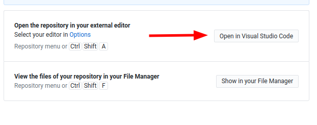

## Dateien hinzufügen und ändern

Legen Sie jetzt eine neue Python-Datei mit dem Namen `main.py` im Repository, zum Beispiel über Visual Studio Code an.
~~~python
name = input("Wie heißen Sie: ")
print("Hallo " + name)
~~~

Im Gegensatz zu Programmen wie Dropbox oder der HU Box müssen Änderungen an den Dateien explizit markiert und in einem Commit zusammengefasst werden.
In GitHub Desktop markiert man dazu die geänderten Dateien, füllt eine Commit-Nachricht aus und comitted die Änderungen.
Dieser Commit ist dann Teil der *History* des Repositories.
Wenn alle lokal geänderten bzw. hinzugefügten Dateien Teil des Commits waren, wird GitHub Desktop "No local changes" anzeigen.

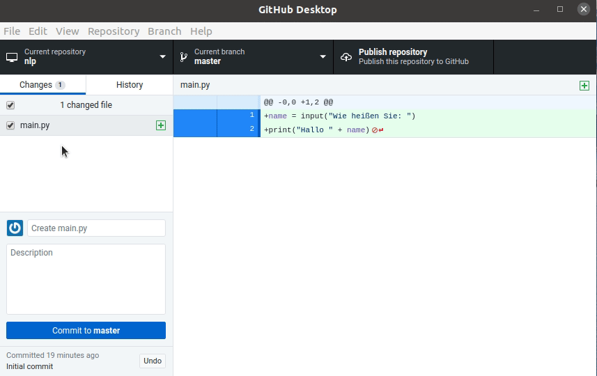

Auf der Kommandozeile werden Änderungen mit `git add <datei>` vorgemerkt und dann mit `git commit -m Nachricht` comitted.
~~~bash
git add main.py
git commit -m "Initial Script"
~~~

Git verwaltet Änderungen zeilenweise.
Sobald eine Datei geändert wird, zeigt GitHub Desktop die geänderten Zeilen an.
Ändern Sie `main.py` so, dass am Ende der Ausgabe ein Ausrufezeichen steht, speichern Sie die Datei ab und GitHub Desktop wird die lokalen Änderungen anzeigen.

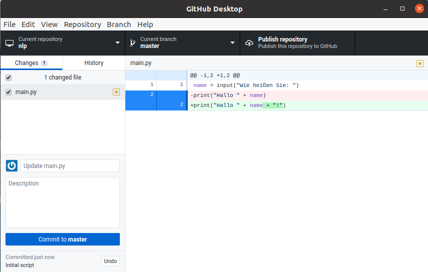

Äquivalent dazu ist der Aufruf von `git diff` auf der Kommandozeile.
~~~bash
git diff
~~~

~~~
diff --git a/main.py b/main.py
index f0b5686..936e410 100644
--- a/main.py
+++ b/main.py
@@ -1,2 +1,2 @@
 name = input("Wie heißen Sie: ")
-print("Hallo " + name)
+print("Hallo " + name + "!")
~~~
{: .output}


Markieren Sie auch die neuen Änderungen und committen Sie diese mit einer Aussagekräftigen Commit-Nachricht, zum Beispiel "Added more excitement when welcoming the user.".
In dem Tab "History" listet GitHub Desktop alle Commits mit ihren Nachrichten, dem Autor und den geänderten Zeilen auf.

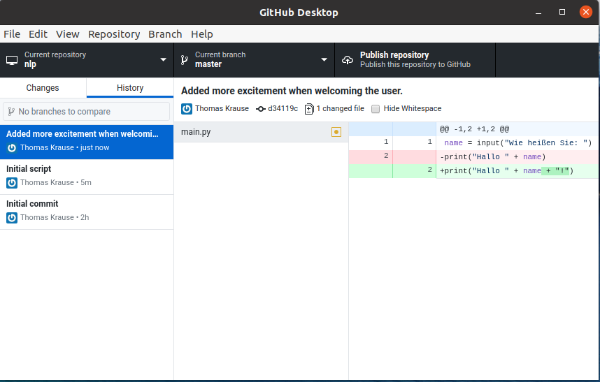

Jeder Commit hat dabei eine eindeutige ID, in dem Screenshot ist es zum Beispiel `d34119c` für den Commit, in dem das Ausrufezeichen hinzugefügt wurde (unter dem Titel oben rechts im Bild).
Diese ID wird bei Ihnen anders sein, da der Nutzername, die E-Mail, Zeitstempel und alle bisherigen Commits in die Berechnung dieser ID eingehen.
Wenn zwei Commit die gleiche ID haben können Sie sich sicher sein, dass Sie die gleiche Version des Repositories mit dem gleichen Dateiinhalt haben.

Auf der Kommandozeile listet `git log` alle Commits und ihre ID auf.
~~~bash
git log
~~~

~~~
commit d34119cd81d054d02b87dedd6dbff14ef65e93b8 (HEAD -> master)
Author: Thomas Krause <krauseto@hu-berlin.de>
Date:   Tue Jun 9 16:54:04 2020 +0200

    Added more excitement when welcoming the user.

commit f22fe3b7787a10c18039e907474d0cef03785705
Author: Thomas Krause <krauseto@hu-berlin.de>
Date:   Tue Jun 9 16:49:00 2020 +0200

    Initial script
    
    The script just asks the user for its name and prints a welcome message.

commit 561e8c6b06e757868fd31bafa619e7c0b43c01e8
Author: Thomas Krause <krauseto@hu-berlin.de>
Date:   Tue Jun 9 14:36:46 2020 +0200

    Initial commit
~~~
{: .output}

Im Gegensatz zu GitHub Desktop listet `git log` die komplette ID und nicht nur die ersten Zeichen auf.
Zur eindeutigen Identifikation des Commits reichen aber meist die ersten 7 Zeichen.

Sie können lokale Änderungen auch rückgängig machen anstatt Sie zu committed.
Wenn Sie zum Beispiel das Ausrufezeichen in ein Fragezeichen ändern und `main.py` speichern, wird die Änderungen in GitHub Desktop angezeigt.
Sie können dann mit der rechten Maustaste auf die geänderte Datei unter "Changes" klicken und "Discard changes..." auswählen.

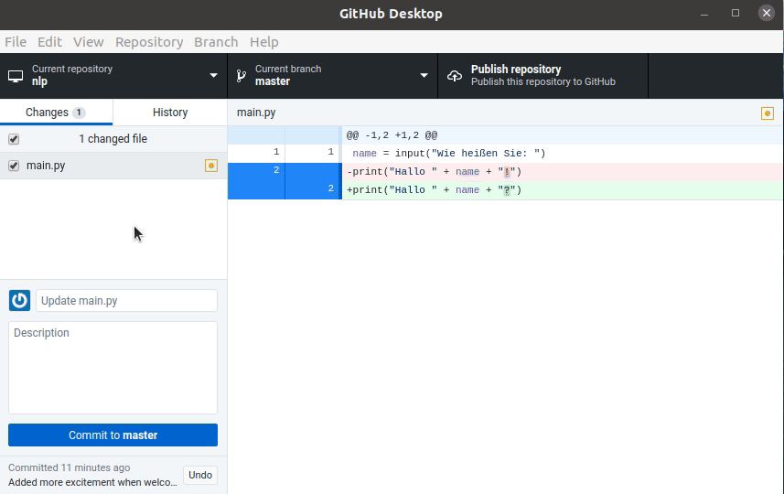

Dieser Befehl ändert die Datei auf der Festplatte, weswegen ein extra Bestätigungsdialog erscheint.
Die Kommanzeilenvariante basiert auf dem Befehl `git checkout <version> <file>`, der Dateien in bestimmten Versionen aus dem Repository wiederherstellt.
Wir verwenden die spezielle Meta-Version "HEAD", die für den letzten lokalen Commit steht.

~~~bash
git checkout HEAD main.py
~~~

~~~
1 Pfad von 80b993b aktualisiert
~~~
{: .output}

## Synchronisieren von Repositories

### Anlegen eines neuen Projekts in GitLab

Um Quelltexte zu teilen, muss man ein Repository auf einem Server anlegen.
Für das GitLab der HU loggen Sie sich zuerst unter <https://scm.cms.hu-berlin.de/> ein und drücken Sie dann die grüne "New Project" Schaltfläche.

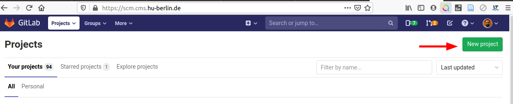

Füllen Sie danach das Eingabeformular für neue Projekte mit dem Namen und einer optionalen Beschreibung aus. 
Sie können einstellen, wer das Projekt sehen kann. 
Stellen Sie sicher, dass "Initialize repository with a README" nicht ausgewählt ist.

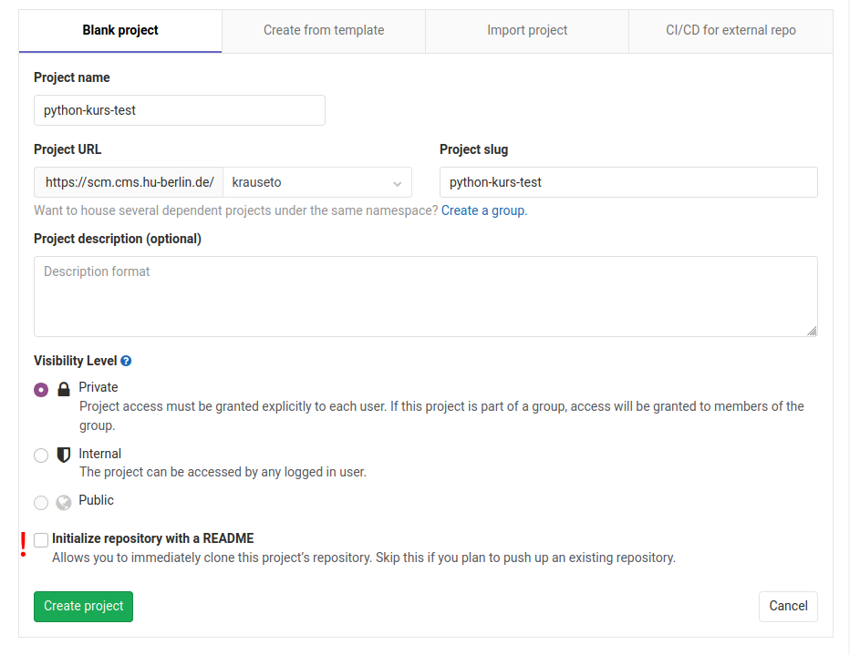

### Pushen der Änderungen

Das erstelle Repository ist komplett leer, beinhaltet also keine Commits.
Um die lokalen Commits zum entfernten Repository hinzuzufügen, muss es als sogenanntes Remote-Repository registriert werden.
Dazu klicken Sie zuerst auf die blaue "Clone" Schaltfläche und kopieren Sie die URL unter "Clone with HTTPS".

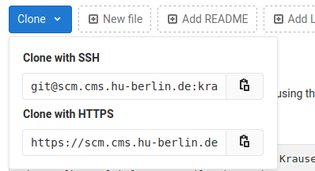

Das Registrieren des Remote-Repositories geht leider nicht im GitHub Desktop Client[^remotegithub], deswegen müssen wir auf die Kommandozeile ausweichen und im Repository-Ordner als aktuellem Verzeichnis folgenden Befehl ausführen:
~~~bash
git remote add origin https://scm.cms.hu-berlin.de/krauseto/python-kurs-test.git
~~~
Dieser Befehl fügt ein neues Remote-Repository mit dem Namen "origin" und gegebenen URL hinzu (diese muss natürlich ihre eigene URL, nicht die aus dem Beispiel sein).


[^remotegithub]: GitHub möchte mit seinem Produkt natürlich die eigene Plattform unterstützen, deswegen ist es kein Problem unter "Publish Repository" ein GitHub.com Repository auszuwählen, aber leider nicht von anderen Plattformen wie dem HU GitLab.

Sie müssen das Remote-Repository nur einmal hinzufügen.
Danach können Sie auch weiter in GitHub Desktop arbeiten.
Der erste Schritt ist, alle lokalen Commits in das entfernte Repository mit "Publish changes" zu übertragen.

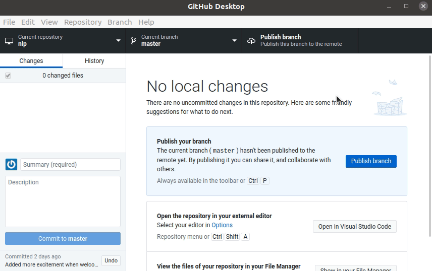

Ein Neuladen der Projekt-Seite in GitLab sollte nun die Dateien des Repositories anzeigen.

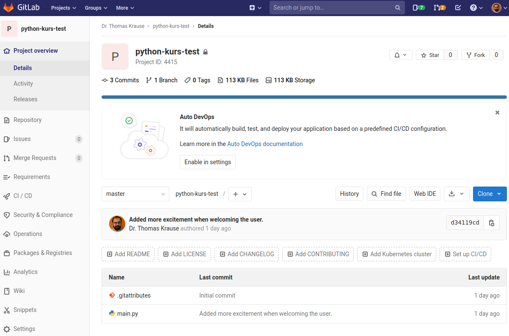

Auf der Kommandozeilen kann man alle lokalen Commits mit 
~~~bash
git push origin master
~~~
"origin" ist der vorher vergebene Kurzname für das Remote-Repository und "master" der sogenannte Branch, der übertragen werden soll.
Wir werden später Branches kennenlernen, im Moment müssen Sie aber nur wissen, dass der Standard-Branch "master" heißt.


### Hinzufügen andere Entwickler

Auf ein Remote-Repository können mehrere Nutzer zugreifen.
Fügen Sie Ihre Projektmitglieder unter "Settings -> Members" hinzu.
Um mit am Quelltext arbeiten zu können, muss mindestens die Rolle "Developer" zugewiesen werden.

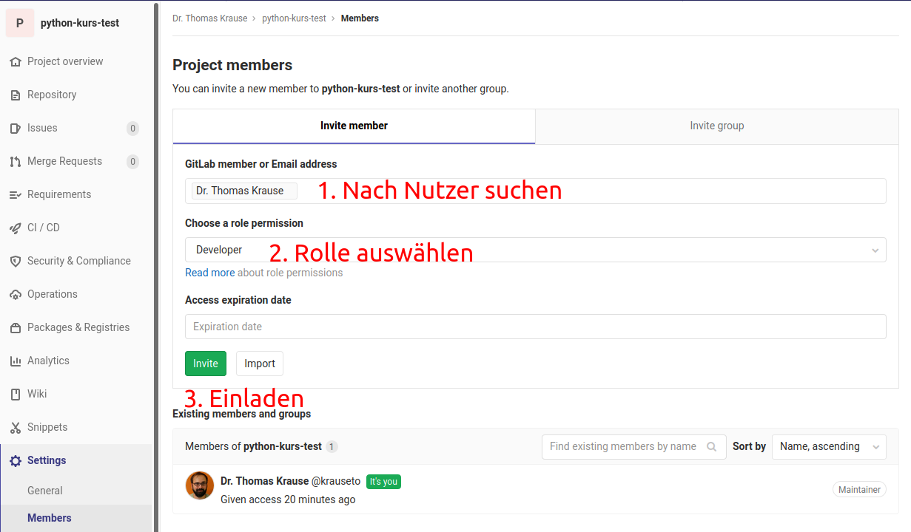

### Klonen eines neuen Repositories

Im Projekt werden Sie vermutlich nur ein Repository nutzen.
Einer der Team-Mitglieder erstellt dieses Repository und die anderen müssen es dann auf Ihren Rechner übertragen.
Auf der Kommandozeile würde man dazu ein neues Verzeichnis erstellen und mit `git clone` und der URL, die man über die Schaltfläche "Clone" erhalten hat ein neues lokales Repository als Kopie erstellen.
Als weiteres optionales Argument kann man den Namen der neuen Arbeitskopie (also des Ordners) angeben.

~~~bash
cd ~/Dokumente/studium/
git clone https://scm.cms.hu-berlin.de/krauseto/python-kurs-test.git nlp-clone
cd nlp-clone
~~~ 

Über das Menü "File -> Clone repository" kann man im GitHub Desktop ebenfalls ein bestehendes Projekt klonen.
In der Projektübersicht links oben kann man dann zwischen den verschiedenen Arbeitskopien die in GitHub Desktop registriert sind wechseln.

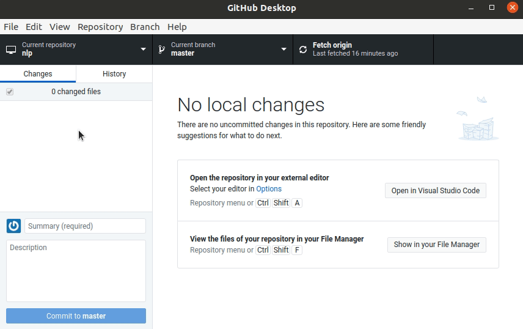

### Änderungen vom Remote-Repository übernehmen

Wenn andere Entwickler Änderungen comitten und per "push" übertragen, können wir zwar die Änderungen in der GitLab Projektansicht sehen, aber haben den neuesten Stand der Dateien nicht lokal in unserem eigenen Repository.
Das Holen der Änderungen vom entfernten Repository ist in Git eine explizite Aktion.
Um zu emulieren, dass ein anderes Mitglied committed und dann gepushed hat, klicken wir in der Projektansicht von GitLab auf die Datei "main.py" und editieren sie direkt in GitLab.

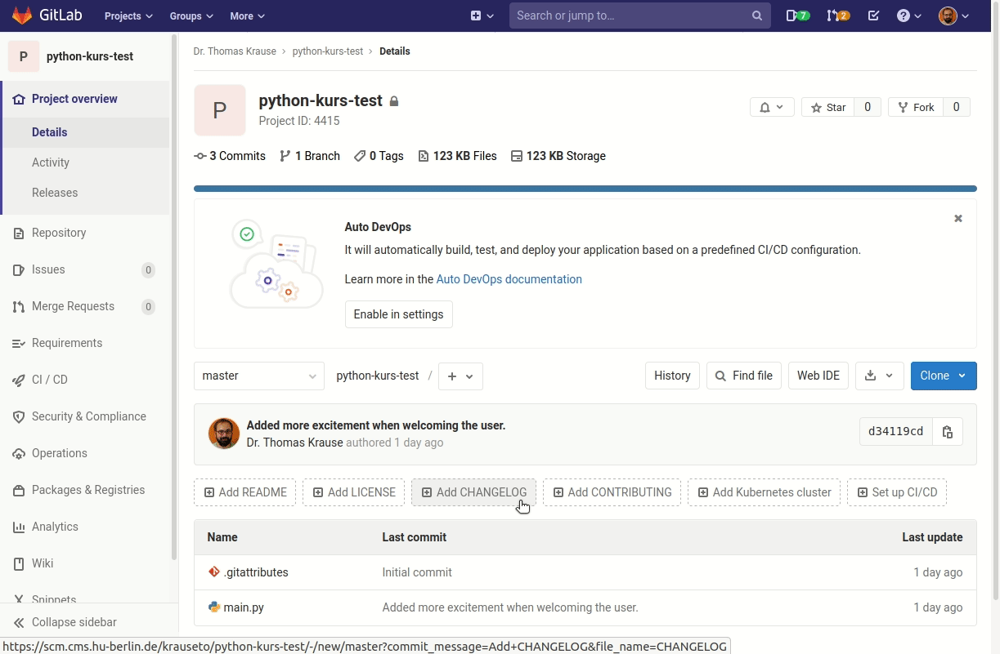

Diese entfernten Änderungen können Sie dann in GitHub Desktop erst "fetchen" und dann "pullen".
Der Schritt "Fetch origin" überträgt die Commits. 
Der Pfeil mit der "1" zeigt an, dass ein entfernten Commit bereitsteht und angewendet werden kann. 
Die zweite Aktion "Pull origin with rebase" aktualisiert dann die Dateien im Arbeitsordner auf den aktuelleren Commit des entfernten Repositories anstatt des älteren lokalen Commits.
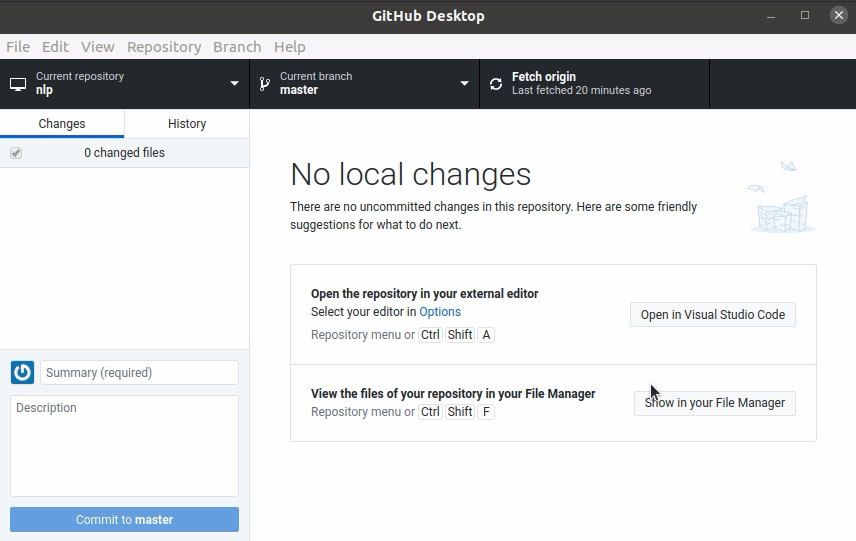
Die entsprechenden Kommandozeilenbefehle sind entsprechend:
~~~bash
git fetch origin
git pull origin master
~~~

Solange das Remote-Repository keine neueren Commits hat, kann man nun neue lokale Commits wieder mit "push" zum Remote-Repository hochladen.
Falls es neuere Commits gibt, kann man diese zuerst "fetchen" und dann "pullen".
Legen Sie zum Beispiel eine neue Datei `README.md` mit dem einer Projektbeschreibung in [Markdown](https://www.markdownguide.org/getting-started) an.

~~~markdown
# Beispiel-Seminarprojekt

TODO: Beschreibung des Vorhabens

## Setup

Installieren Sie alle benötigten Pakete mit:

```
pip install nltk
```

~~~

Mit dem "Add", "Commit, und "Push" können Sie diese Änderungen wieder hochladen.
Dieser Zyklus aus Pullen und Pushen wiederholen Sie für jede Änderung.

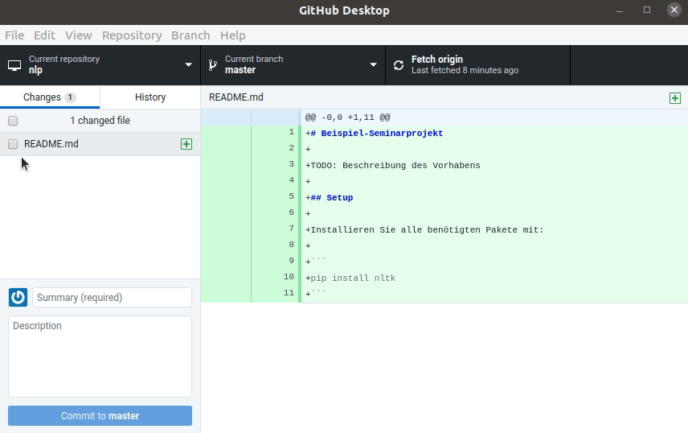

> ## Wann sollte man pullen und pushen?
> Pullen und pushen Sie möglichst häufig, damit Ihr lokaler Stand nicht zu sehr von dem der anderen Projektmitglieder abweicht.
> Bevor Sie zum Beispiel anfangen lokal die Quelltexte zu bearbeiten, sollten Sie vorher einmal "Pull" ausgeführt haben.
> Committen Sie auch kleine Änderungen und pushen Sie sie gleich nach dem Commit.
{: .callout}

## Branches

Bisher haben wir nur Änderungen (also Commits) nur linear aufeinander aufgebaut.
Auf Commit A folgt Commit B etc.
Zum Beispiel würden die Commit-Befehle
~~~bash
git add file1.txt
git commit -m "commit A"
git add file2.txt
git commit -m "commit B"
git add file1.txt
git commit -m "commit C"
~~~
zu einer linearen Commit-Historie führen:
~~~
master branch
      |
      + commit A
      |
      + commit B
      | 
      + commit C
      |
     ...
~~~


Ein Branch ist dabei die Sammlung einer linearen Abfolge von Commits.
Git erlaubt das Abzweigen eines neuen Branches von einer bestehenden Commit-Abfolge.
Nach dem Abzeigen mit `git branch <Name neuer Branch>` muss man die lokale Arbeitskopie auf diesen Branch umstellen `git checkout <Name neuer Branch>` und kann dann unabhängig vom Original-Branch commiten, bis man die beiden Branches wieder zusammenführt, in dem man zuerst die Arbeitskopie wieder auf den master-Branch mit `git checkout master` umschalten und dann den neuen Branch merged `git merge <Name neuer Branch>`. zusammenführt.
~~~
       master branch
            |
            |\
            | \
            |   bugfix-123 branch
   commit A +   |
            |   |
            |   + commit B
            |   + commit C
            | /
            |/ 
            + merging branch
~~~
"master" enthält nach dem Mergen alle Commits aus beiden Branches.

GitHub Desktop erlaubt ebenfalls das abzweigen und zusammenführen neuer Branches sowie das Umschalten der Arbeitskopie auf den Stand eines jeweiligen Branches.

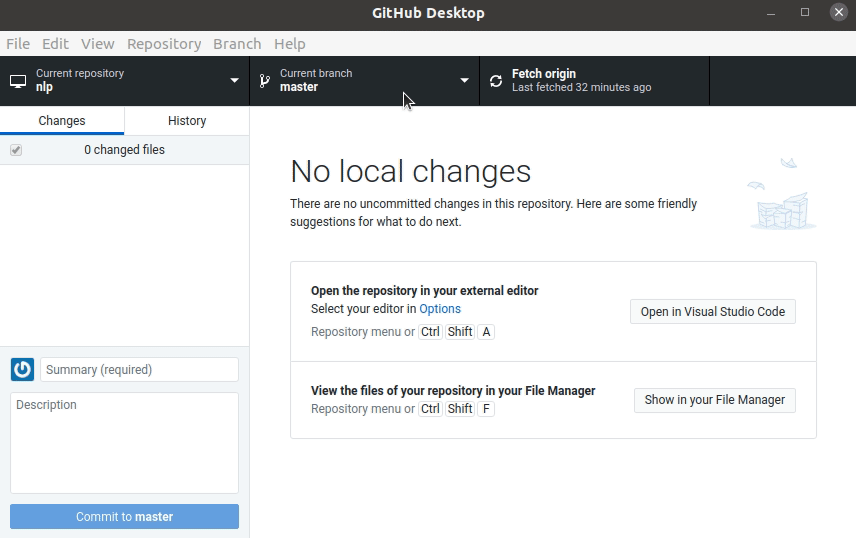

Auf welchem Branch die Arbeitskopie aktuelle eingestellt ist, wird oben unter "Current Branch" angzeigt.
In dem Branch können Sie nun neue Commits hinzufügen.
Um Sie zu mergen, wechseln Sie erst zurück auf den "master" branch, klicken Sie dann auf die Branch-Auswahl Schaltfläche und wählen Sie "Choose a branch to merge into master".
Wählen Sie den Branch aus und bestätigen Sie das mergen.
Die neuen Commits sollten Sie danach direkt auch wieder pushen.

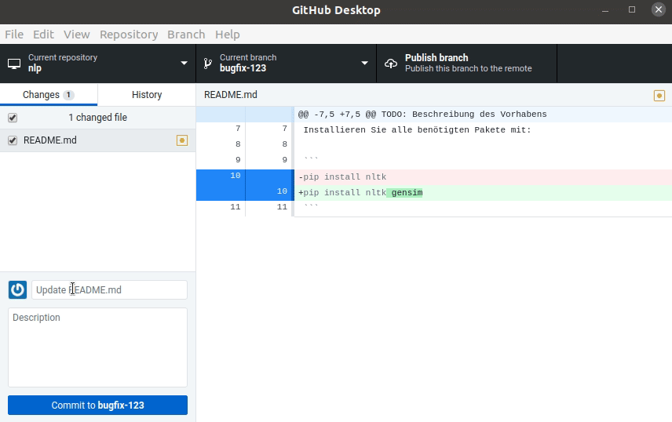

Sie können auch Branches auf dem entfernten Repository mit "Publish" und "Push" hochladen.

## Weiterführende Themen

### GitHub Desktop Hilfe

Git hat sehr viele Funkionen und gerade der Umgang mit Branches kann am Anfang schwierig sein.
Die Online-Hilfe von GitHub Desktop beschreibt viele typische Git-Arbeitsschritte, darunter auch die hier vorgestellten: <https://help.github.com/en/desktop/contributing-to-projects>.

### Konflikte

Besonders wichtig ist der Umgang mit Konflikten.
Wenn zwei Entwickler an verschiedenen Dateien oder verschieden Zeilen der gleichen Datei arbeiten, wird Git beim mergen die Versionen einfach zusammenführen.
Bei Änderungen an der gleichen Datei in der gleichen Zeile wird es aber zu so einem sogenannten Konflikt kommen.
Diesen müssen Sie manuell auflösen (also bestimmen welche Zeile übernommen wird und welche nicht).
Neuere Versionen von GitHub Desktop unterstützen Sie bei der Auflösung des Commits.
Wenn ein Konflikt ensteht, können Sie entweder auswählen welcher der beiden Versionen (aus Ihrem Branch oder dem entfernten) genommen werden soll oder Sie können die Datei in Visual Studio Code öffnen lassen.

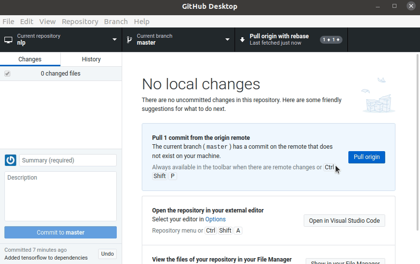

Die Datei mit dem Konflikt enthält beide Zeilen und die Markierungen `<<<<<<<` am Konflikt-Anfang `=======` für die Grenze zwischen der einen und der anderen Variante und ">>>>>>>" für das Ende des Bereichs mit dem Konflikt.
~~~
<<<<<<< HEAD
pip install nltk gensim art
=======
pip install nltk gensim tensorflow
>>>>>>> Added tensorflow to dependencies
~~~

Passen Sie die Datei manuell mit den gewünschten Änderungen an und stellen Sie sicher, die Zeilen mit den Konflikt-Markern dabei entfernt zu haben.
Also zum Beispiel durch die zusammengeführte Zeile, die beide neuen Abhängigkeiten enthält.
~~~
pip install nltk gensim art tensorflow
~~~
Sobald Sie die Konfliktmarker entfernt haben, wird GitHub Desktop erlauben das Mergen fortzusetzen.

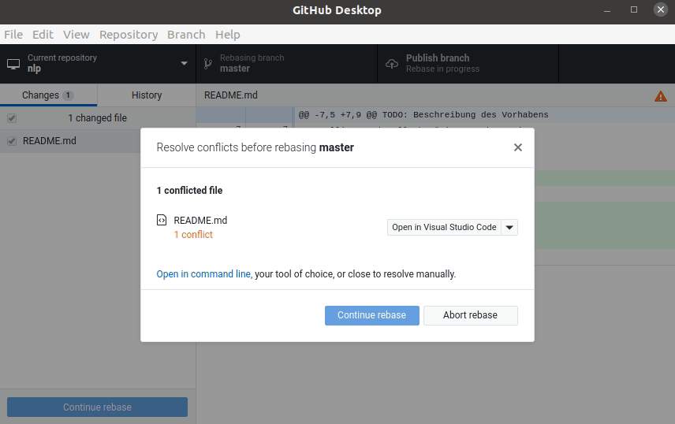

### Mehr über Git Kommandozeile

Um sehr tief in die Bedienung von Git auf der Kommandozeile einzusteigen, können Sie die Lektionen zu Git vom Software Carpentry Projekt durcharbeiten: <http://swcarpentry.github.io/git-novice/>.