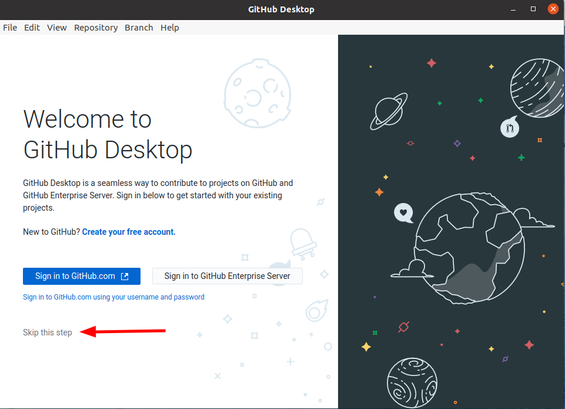
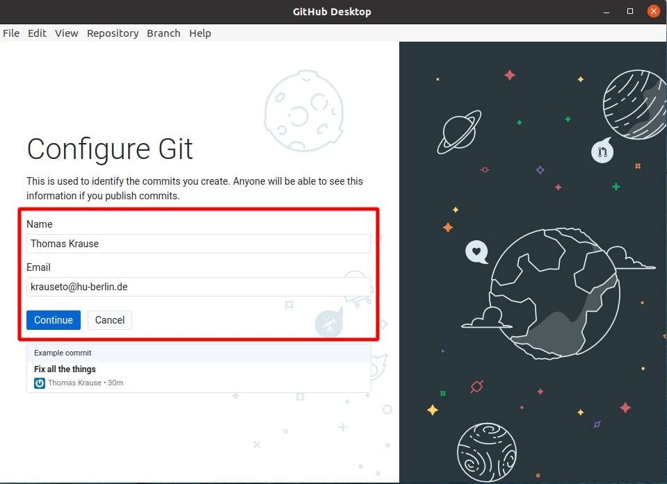

## Einführung und Terminologie

Das Arbeiten an Quelltexten ist typischerweise inkrementell. 
Das führt schnell dazu, dass man Überblick über die verschiedenen Versionen verliert.
Beim Schreiben von Texten gibt es dann oft die Strategie, die Versionierung im Dateinamen auszudrücken (also z.B. "final.doc", "final_rev2.doc", final_final.doc").[^final]
Außerdem benötigen wir bei gemeinsamen Arbeiten in Projekten auch einen gemeinsamen Stand des Quelltexts, auf den alle Projektmitglieder zugreifen können.

[^final]: Zu den Problemen die durch „Versionen“ im Dateinamen entstehen können, sei auch die [PHD Comics Episode dazu](http://phdcomics.com/comics/archive.php?comicid=1531) empfohlen.

Anstatt manuell eigene Versionierungs-Mechanismen zu erarbeiten, können wir auch bestehende Versionskontrollsysteme (VCS) nutzen.
Dieses soll uns in die Lage versetzen
- Änderungen unabhängig vom Dokument betrachten,
- Änderungen in Dokumenten automatisch zu verfolgen,
- Änderungen rückgängig zu machen bzw. „zurückspulen“,
- nachvollziehen zu können, wer in dem Projekte welche Änderungen gemacht hat,
- nicht aus Versehen Änderungen anderer übersehen und/oder überschreiben.

Inzwischen hat sich das Kommandozeilen-Programm Git als de-facto Standard Versionskontrollsystem für Quelltexte etabliert.
Man kann es aber auch für andere Textdatei-lastige Projekte, wie zum Beispiel Korpusannotationsdateien nutzen.

Die Konzepte von Versionsverwaltungsprogrammen folgen einer eigenen Terminologie, die gerade am Anfang etwas überwältigend sein kann.
Im [Glossar](https://help.github.com/en/github/getting-started-with-github/github-glossary) der GitHub-Platform können Sie die wichtigsten Begriffe, die wir auch hier verwenden werden, nachschlagen.
Dazu gehören unter anderem,

- *repository* <https://help.github.com/en/github/getting-started-with-github/github-glossary#repository>
- *clone* <https://help.github.com/articles/github-glossary/#clone>
- *fetch* <https://help.github.com/articles/github-glossary/#fetch>
- *pull*  <https://help.github.com/articles/github-glossary/#pull>
- *commit*  <https://help.github.com/articles/github-glossary/#commit>

##  Tools und Plattformen

Um gemeinsam Quelltexte zu bearbeiten, benötigen wir zwei Dinge: 
- die Software zum Versionieren selbst (in diesem Fall Git)
- einen Ort an dem wir von Git erstellten Repositories abspeichern und von dem wir unsere eigenen Kopien synchronisieren.

Wir werden die grafische Oberfläche [GitHub Desktop](https://desktop.github.com/) (nicht zu verwechseln mit der Online-Platform GitHub.com, aber von der gleichen Firma) nutzen, die Sie von <https://desktop.github.com/> für Ihr Betriebsystem herunterladen können. 
Für Linux werden inoffizielle Installationspakete unter <https://github.com/shiftkey/desktop/releases/> bereitgestellt.
Gleichzeitig werden wir auch immer für jede Aktion in GitHub Desktop den entsprechenden Git-Kommandozeilen-Aufruf zeigen.
GitHub Desktop bringt seine eigene Git-Installation mit.
Wenn Sie die Kommandozeilenbefehle nachvollziehen möchten, müssen Sie deswegen, deswegen müssen Sie Git für die Kommandozeile von <https://git-scm.com/downloads> installieren. Unter Linux ist `git` typischerweise schon in den Paketquellen vorhanden und kann zum Beispiel mit `sudo apt install git` unter Ubuntu installiert werden.

Eine populäre Platform für Git-basierte Projekte ist [GitHub.com](https://github.com/), die zum Konzern Microsoft gehört.
Diese erlaubt inzwischen auch das Erstellen von nicht-öffentlichen Projekten und kann daher auch für eigene Studien-Projekte geeignet sein.
Daneben gibt es aber auch Alternativen wie GitLab, das einerseits eine [zentrale Plattform](https://about.gitlab.com/) analog zu GitHub.com ist, deren Software man aber auch auf eigenen Servern installieren und betreiben kann.
Die HU-Berlin betreibt unter <https://scm.cms.hu-berlin.de/> eine solche GitLab-Instanz auf ihren eigenen Servern, auf der Sie sich mit Ihrem CMS-Acccount einloggen können.
Diese verschiedenen Plattformen haben oft ähnliche Funkionen, wie zum Beispiel Ticketsysteme zum Verwalten von Bugs und TODOs.
In diesem Tutorial werden wir die GitLab-Instanz der HU nutzen, aber das Prinzip ist für die anderen Plattformen gleich.

## Anlegen eines neuen lokalen Git-Repositories

Git arbeitet auf sogenannten *Repositories*, die alle Dateien und die komplette Versionshistorie beinhalten.
Ein Git-Repository besteht aus einem lokalen Ordner mit den zu versionierenden Dateien und einem speziellen versteckten Unterordner `.git`.

Zum Anlegen eines Git-Reppositories, starten Sie GitHub Desktop.
Beim ersten Start wird das Programm Sie auffordern, einen Account auf GitHub.com anzulegen, da wir das GitLab der HU nutzen werden, können Sie diesen Schritt bedenkenlos überspringen.

Trotzdem benötigt Git die Angabe eines Namens und einer E-Mail-Adresse.
Diese Informationen werden in der Versionshistorie als Felder für den Autor angezeigt. 
Beide Angaben werden nur lokal gespeichert und nicht verifiziert, weder der Name noch die E-Mail-Adresse müssen stimmen.

Wählen Sie im Startbildschirm von GitHub Desktop jetzt „Create a new Repository on your hard drive...“ aus, um ein neues Repository als Ordner in einem beliebigen Pfad anzulegen.

Falls bereits ein Repository offen ist, können Sie neue Repositories auch das Menü und "File -> New repository" anlegen.
Auf der Kommandozeile würde man erst einen neuen Ordner erstellen, in diesem mit `cd` wechseln und dann `git init` ausführen, um das gleiche Ergebnis zu erreichen.

~~~bash
mkdir nlp
cd nlp
git init
~~~
~~~
Leeres Git-Repository in /home/thomas/Dokumente/studium/nlp/.git/ initialisiert
~~~
{:.output}