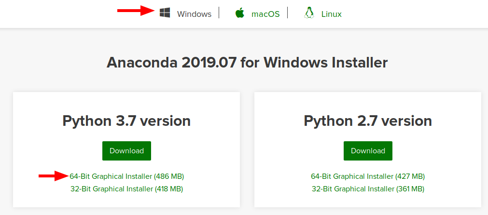

## Vorrausetzungen

- Betriebsystem
  * Windows 7 oder neuer, *oder*
  * macOS 10.10+ *oder*
  * Linux (Ubuntu, ReadHad, CentOS 6+, ...)
- Minimum 5 GB freier Festplattenspeicher   

## Download und Installation von Anaconda

Es gibt verschiedene Versionen von Python und Python-Programme nutzen oft sogenannte Bibliotheken als Abhängigkeit, die man auch installieren muss
Damit alle Teilnehmer des Kurses die *gleiche Python-Umgebung* mit den gleichen Bibliotheken verwenden, nutzen nutzen wir **Anaconda für Python 3.7**, eine Software die Python, viele Bibliotheken und Tools schon mitbringt

1. Laden Sie Anaconda für Python 3.7 von <https://www.anaconda.com/distribution/> für Ihr Betriebssystem herunter (z.B. Windows 64 Bit).

2. Führen Sie die heruntergeladene Datei aus und folgen Sie den Installationsweisungen.
Bei Problemen können Sie die [Anaconda Installationsanleitung](https://docs.anaconda.com/anaconda/install/) zu Rate ziehen.


