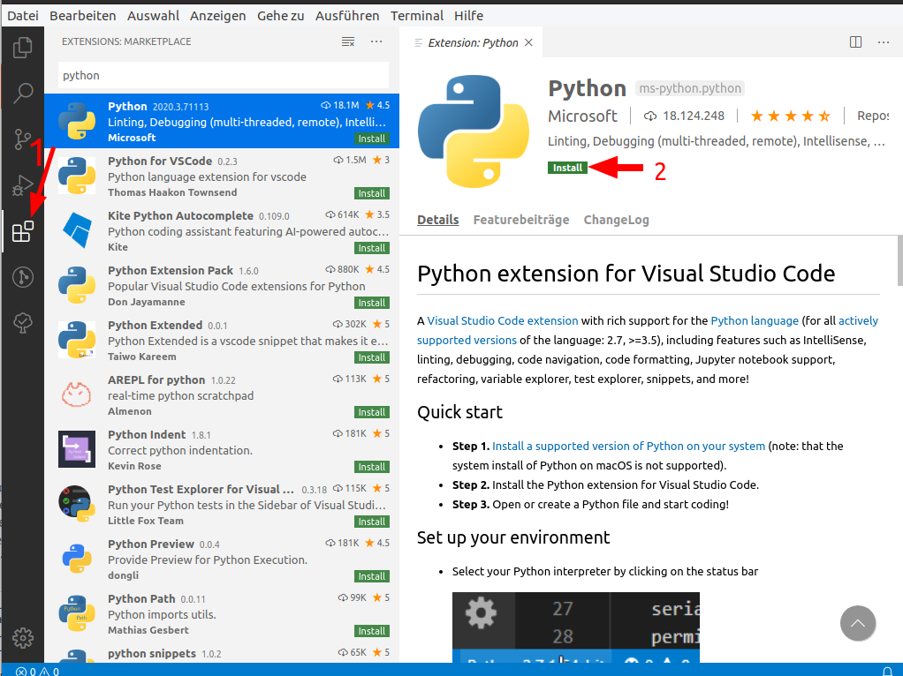

## Vorrausetzungen

- Betriebsystem
  * Windows 7 oder neuer, *oder*
  * macOS 10.10+ *oder*
  * Linux (Ubuntu, RedHad, CentOS 6+, ...)
- Minimum 5 GB freier Festplattenspeicher   

## Download und Installation von Miniconda

Es gibt verschiedene Versionen von Python und Python-Programme nutzen oft sogenannte Bibliotheken als Abhängigkeit, die man auch installieren muss
Damit alle Teilnehmer des Kurses die gleiche Python-Umgebung mit den gleichen Bibliotheken verwenden, nutzen nutzen wir die Python-Distribution **Miniconda für Python 3.7**.
Miniconda liefert ein Paketmanagmentprogramm namens *conda* mit, das es erlaubt solche Abhängigkeiten nachzuinstallieren. 
Wir werden in einer späteren Sitzung auch lernen, wie man Pakete mit *conda* installiert, aber erst einmal nutzen wir Miniconda, um alle die gleiche Version von Python zu installieren.

1. Laden Sie Miniconda für Python 3.7 von <https://docs.conda.io/en/latest/miniconda.html> für Ihr Betriebssystem herunter (z.B. Windows 64 Bit). Wenn Sie nicht wissen ob Sie 32 Bit oder 64 Bit benötigen, versuchen Sie es erst mit der jeweiligen 64 Bit Version.

2. Führen Sie die heruntergeladene Datei aus und folgen Sie den Installationsweisungen.
Bei Problemen können Sie die [Miniconda Installationsanleitung](https://conda.io/projects/conda/en/latest/user-guide/install/index.html) zu Rate ziehen.
3. Nach der Installation sollte das Programm `python3` in einem System-Terminal aufrufbar sein.

## Download und Installation von Visual Studio Code

Um Python-Skripte zu schreiben, sollte man möglichst einen guten Editor haben.
In diesem Tutorial werde wir die sogenannte „Integrated Development Environment“ (IDE) Visual Studio Code (kurz VS Code) benutzen.
Diese ist für Windows, Mac und Linux als Open Source Software frei verfügbar.

1. Laden Sie das Installationsprogramm für Ihr Betriebssystem von <https://code.visualstudio.com/Download> herunter
2. Befolgen Sie die betriebsystem-spezifischen Installationsanweisungen
3. Starten Sie VS Code

> ## Datenschutz
>
> Leider kann Visual Studio Code Telemetriedaten (also z.B. dass die Software benutzt wird oder welche Plugins installiert sind) an den Hersteller Microsoft senden.
> Es ist inzwischen einfacher geworden, diese in der Software selbst abzustellen: <https://code.visualstudio.com/docs/getstarted/telemetry>.
> Das Projekt VSCodium (<https://github.com/VSCodium/vscodium/>) bietet eine Version von VS Code an, in dem das Sammeln von Telemetriedaten bereits ausgebaut ist.
> Sie können diese alternativen Installationsdateien [hier](https://github.com/VSCodium/vscodium/releases/) herunterladen. 
> VSCodium hat die gleichen Funktionen wie VS Code und kann auch die gleichen Plugins installieren.
{: .callout}

VS Code ist in der Grundaustattung eine Art Texteditor, der mit neuen Funktionen erweitert werden kann.
In der linken Leiste finden Sie ein Symbol zum Installieren von Erweiterungen ("Extensions"), klicken Sie darauf, suchen Sie nach „Python“ und installieren Sie die Erweiterung mit der ID `ms-python.python` von Microsoft.



