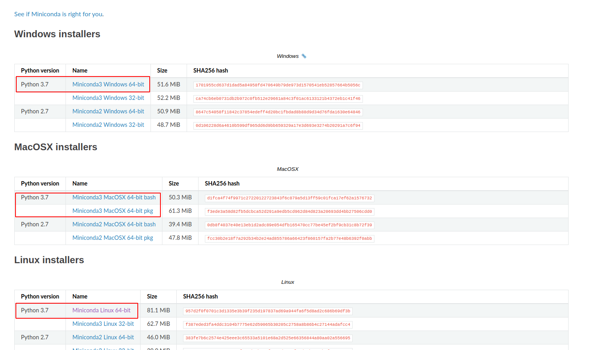

## Vorrausetzungen

- Betriebsystem
  * Windows 7 oder neuer, *oder*
  * macOS 10.10+ *oder*
  * Linux (Ubuntu, ReadHad, CentOS 6+, ...)
- Minimum 5 GB freier Festplattenspeicher   

## Download und Installation von Miniconda

Es gibt verschiedene Versionen von Python und Python-Programme nutzen oft sogenannte Bibliotheken als Abhängigkeit, die man auch installieren muss
Damit alle Teilnehmer des Kurses die gleiche Python-Umgebung mit den gleichen Bibliotheken verwenden, nutzen nutzen wir die Python-Distribution **Miniconda für Python 3.7**.
Miniconda liefert ein Paketmanagmentprogramm namens *conda* mit, das es erlaubt solche Abhängigkeiten nachzuinstallieren. 
Wir werden in einer späteren Sitzung auch lernen, wie man Pakete mit *conda* installiert, aber erst einmal nutzen wir Miniconda, um alle die gleiche Version von Python zu installieren.

1. Laden Sie Miniconda für Python 3.7 von <https://docs.conda.io/en/latest/miniconda.html> für Ihr Betriebssystem herunter (z.B. Windows 64 Bit). Wenn Sie nicht wissen ob Sie 32 Bit oder 64 Bit benötigen, versuchen Sie es erst mit der jeweiligen 64 Bit Version.

2. Führen Sie die heruntergeladene Datei aus und folgen Sie den Installationsweisungen.
Bei Problemen können Sie die [Miniconda Installationsanleitung](https://conda.io/projects/conda/en/latest/user-guide/install/index.html) zu Rate ziehen.
3. Nach der Installation sollte das Programm `python3` in einem System-Terminal aufrufbar sein.


